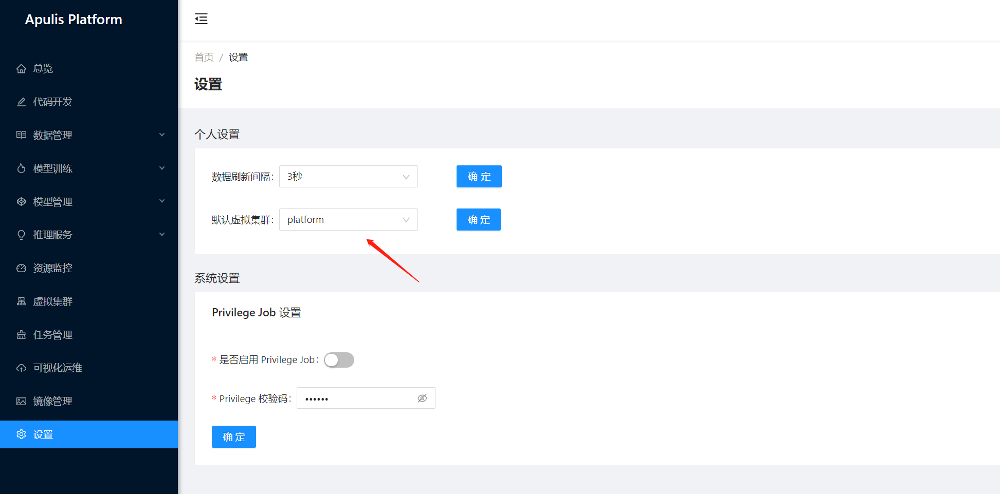
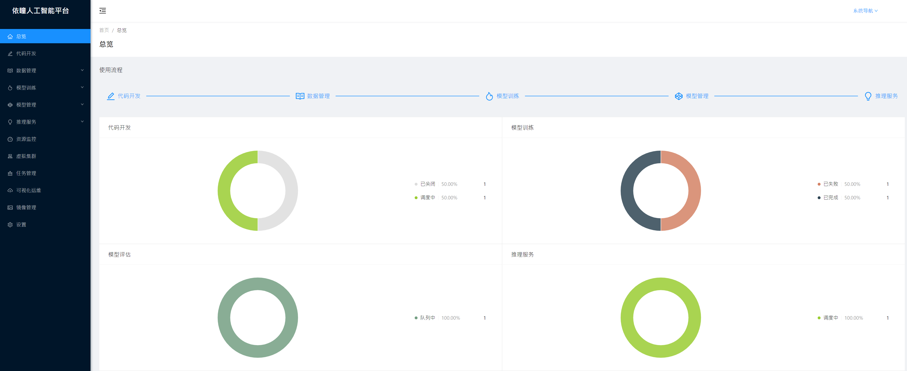
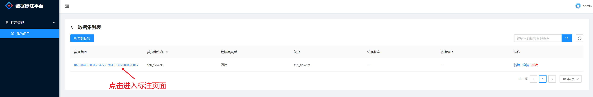
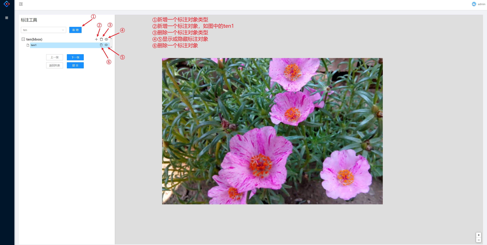
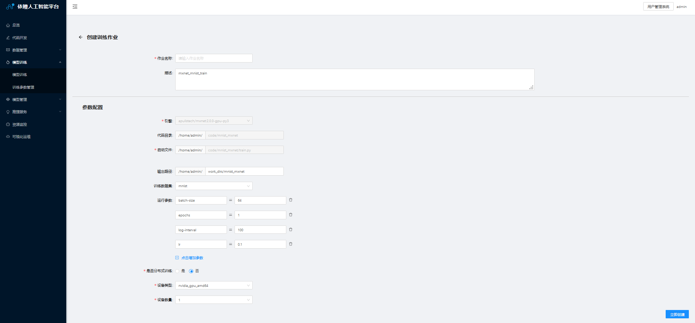
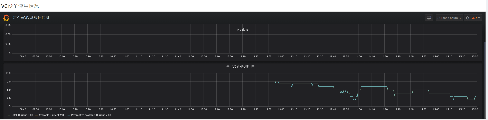

#  用户手册

  版本         1.5.0
  ------------ ------------
  发布时间：   04 02 2021

依瞳科技（深圳）有限公司

[TOC]

## 用户指南

在本文档中，您可以了解到用户在依瞳人工智能平台上，进行深度神经网络模型训练的操作方法，并且可以管理自己的训练任务、监控任务的执行情况、查看集群节点的运行情况等。

目标读者：深度学习算法工程师和业务开发者。

## 产品简介

### 产品概述

依瞳人工智能平台旨在为不同行业的用户提供基于深度学习的端到端解决方案，使用户可以用最快的速度、最少的时间开展高性能的深度学习工作，从而大幅节省研究成本、提高研发效率，同时可为中小企业解决私有化部署困难、成本高等问题。

平台提供了模型训练、代码开发、模型管理，数据管理，在线推理服务，资源监控，虚拟集群等开发环境，方便AI开发者快速搭建人工智能开发环境，开展AI开发应用。在监控模块基础上搭建预警模块，自动将平台异常通知管理员，提升平台的预警效率及安全性能。

### 名词解释

  术语、缩略语   解释
  -------------- -------------------------------------------------------------------------------------------------------------------------------------------------------------------------------------------------------------
  Tensorflow     TensorFlow是一个分布式系统上的大规模深度学习框架。移植性好，可以运行在移动设备上，并支持分布式多机多卡训练，支持多种深度学习模型。
  PyTorch        不同于 TensorFlow，PyTorch 采用动态计算图的方式，提供良好的 Python 接口，代码简单灵活，使用起来非常方便。内存分配也经过了优化，能支持分布式多机训练。
  MindSpore      MindSpore是端边云全场景按需协同的AI计算框架，提供全场景统一API，为全场景AI的模型开发、模型运行、模型部署提供端到端能力。
  Kubernetes     简称K8S用于管理云平台中多个主机上的容器化的应用，目标是让部署容器化的应用简单并且高效，提供了应用部署，规划，更新，维护的一种机制。
  引擎           模型开发和训练中可以通用的技术框架，内核或环境。
  代码开发       专家系统中模型训练任务。
  VC             Virtual Cluster简称虚拟集群，对物理集群内所有AI计算芯片进行分组管理，就称为一个虚拟集群。
  设备类型       可用于模型训练的计算资源，比如Nvidia GPU，Atlas NPU。
  设备数量       可以分配给训练任务使用的资源数量。
  镜像           执行模型训练所需要的文件集合。
  Jupyter        Jupyter Lab是一个支持运行多种编程语言的Web的交互式计算环境。方便进行算法代码编写，模型训练任务的提交，和调试等操作。
  SSH            便捷的SSH链接，可以访问到任务容器。
  TensorBoard    一个可视化工具，它可以用来展示网络图、张量的指标变化、张量的分布情况等。在训练网络的时候，我们可以设置不同的参数（比如：权重W、偏置B、卷积层数、全连接层数等），使用TensorBoard可以很直观地进行参数的选择。

### 功能简介

本文主要介绍平台的功能和使用，包括用户资源分配、用户账号和权限管理、代码开发、虚拟集群管理、用户管理、模型训练和数据管理等。用户通过web端提交模型训练任务，在概览页面可查看任务的运行状态、在资源监控页面可以实时的了解资源使用情况、训练任务的日志输出等；通过集群状态监控可查看整个集群的资源使用情况，并可监控各物理节点的状态。

## 访问平台

用户在浏览器地址栏输入平台地址，进入【登录页面】，默认为账号密码登录的页面。推荐使用Chrome
87.0.4280.88（正式版）浏览器。

图1：登录页面

## 注册账号登录

点击登录页面的【注册账户】，跳转到注册页面。设置用户名、昵称、密码后即可完成注册，完成注册后跳转到【登录页面】。使用新注册的账号登录平台后会提示"对不起，您没有当前页面的访问权限"，请联系系统管理员获取权限，关联虚拟集群(VC)，才可以正常登录使用平台。

如用户已有账号，在登录页面输入账号和密码后点击登录按钮，即可登录平台。

图2：用户注册页面

## 用户资源管理

### 运维管理员登录用户管理系统

输入平台登录地址【<http://xxx.xxx.xxx.xxx>】，使用管理员账号admin（其他预置账号）登录。点击系统导航中的【用户管理系统】。

图3：进入用户管理窗口

### 新建普通用户

打开左侧管理页的【用户】菜单，可以查看系统初始化配置的管理员或用户账号，点击【新建用户】，管理员可以新建单个或多个用户。

图4：新建用户账号

按提示填写必要信息，点击下一步（非必要信息可预留）。

图5：新建用户

### 配置用户角色

为新建用户选择用户角色，用户角色主要有System
Admin(系统管理员)，User(普通用户)，Annotation
person(标注用户)，一般用户请选择User角色。

图6：选择用户角色

点击上图中的下一步，进入确认用户信息页面，默认情况系统会为新建用户初始化一个一定复杂度的密码，如果用户希望修改密码则可以点击右侧的编辑，进入编辑窗口。

图7：确认账号基本信息

### 修改初始密码

修改用户密码后，点击保存，继续点击提交，即可完成创建用户。

图8：修改初始用户密码

### 关联虚拟集群

返回人工智能平台，查看虚拟集群，点击虚拟集群右侧的【用户】，选择查看用户。

图9-1：查看用户默认虚拟集群的已有用户

图9-2：查看用户默认虚拟集群的已有用户

添加用户到虚拟集群。

图9-3：向默认虚拟集群添加已创建的用户

如果用户已创建则能够提示选择，选择该用户并点击确定，则就给用户关联了可用的资源。

图10：给用户关联虚拟集群

### 查看已关联的虚拟集群

使用创建的用户登录平台，在【设置】菜单查看关联的虚拟集群，如果用户关联了多个虚拟集群，也可以在这里切换不同的虚拟集群。

图11：普通用户查看关联的虚拟集群

### 管理虚拟集群

仅允许运维管理员可以访问虚拟集群管理窗口，选择左侧的【虚拟集群】，可以查看系统中已创建的虚拟集群。

图12：管理员查看虚拟集群列表

点击【创建虚拟集群】，会自动检测集群中已有的资源类型比如：huawei_npu_arm64以及可用资源的最大限制数。管理员可以根据用户需求和平台剩余资源做相应的配置。

图13-1：管理员新建虚拟集群-资源分配

平台支持管理员通过时间限制用户使用资源，在【最大使用时长】单位【小时】中，管理员可以限制该虚拟集群的最长使用时间。避免用户长期占用不释放的情况；如果用户在使用时间到期后需要延时，也可以向管理员申请延长该虚拟集群的使用时间。

图13-2：管理员新建虚拟集群-时间管理

当虚拟集群当前没有用户正在执行任务或操作的时候，管理员可以编辑或删除该虚拟集群。

图14：删除虚拟集群

当管理员给虚拟集群添加用户后，则该组中的用户都将共享虚拟集群中的所有资源，如果资源已被全部占用，剩余用户新提交的任务会自动排队，等候资源释放。创建虚拟集群后，也可直接添加或移出用户。

图15：给虚拟集群添加或移除用户

### 任务资源限制

> 管理员可以预先设置NPU节点上每个任务中POD的可用最大资源数；POD的资源默认下限为CPU
> 2核，MEM 400 Mb；上限为CPU 22 核，MEM
> 80G；管理员可根据实际情况在后台配置POD的资源上限。
>
> **配置方式如下：**

1.  登录平台管理节点，进入安装配置目录 cd \~/InstallationYTung

2.  修改集群配置文件group_vars/ cluster.yaml中的resource_limit 配置项：

> resource_limit:
>
> huawei_npu_arm64:
>
> cpu: 22
>
> memory: 80Gi

3.  重启restfulapi2 和 Jobmanager2

> ./service_ctl.sh restart restfulapi2

./service_ctl.sh restart jobmanager2

4.  查看配置是否生成

cat /root/build/restfulapi2/config.yaml \# 应该有以下配置

> resource_limit: {\"huawei_npu_arm64\": {\"cpu\": 22, \"memory\":
> \"80Gi\"}}

5.  在资源监控窗口查看任务状态,POD中最大的资源使用量已经被限制在CPU
    22核以内，内存80G以内。

> 

*FAQ: 1. 资源监控中看板的使用单位：pod中CPU 按使用核数，MEM 1G =1000kb;
节点中CPU 按使用时长，MEM 1G=1000kb; 后台监控实际按CPU使用核数，MEM
1Gi=1024kb.*

*2. 当MEM
远超限制时，比如训练进程内存泄漏或死锁时，平台会将该任务停掉，在任务列表中的状态将显示为
"已失败"*

## 总览

页面顶端菜单栏，展示用户管理系统的菜单按钮和当前登录用户。

侧菜单栏包括12个菜单，分别为总览、代码开发、数据管理、模型训练、模型管理、推理服务、资源监控、虚拟集群、可视化运维、镜像管理和设置；其中数据管理包括数据集管理和数据标注，模型训练包括模型训练、训练可视化、训练参数管理和预置模型，模型管理包括我的模型、、评估列表、评估参数管理和可视化建模，推理服务包括中心推理和边缘推理。

> 

图16-1：管理员总览页面

虚拟集群和任务管理只有管理员才可以查看和配置，普通用户登录后则不可见。

> 

图16-2：普通用户总览页面

### 菜单栏

页面顶端的菜单栏如图6所示，最左侧图标的功能为显示、隐藏左侧菜单栏；点击"依瞳人工智能平台"可以跳转到总览界面；点击菜单"用户管理系统"可跳转到用户管理页面，请参考3.2.2章节最右侧显示当前登录用户。

图17：平台主页上方菜单栏

### 使用流程

使用流程中介绍了平台的使用流程图，并提供快捷跳转链接。平台推荐的使用顺序为：先创建代码开发环境，供用户调试模型脚本；上传数据集，进行数据标注；数据标注完成后创建模型训练作业，可选择已标注的数据集；模型训练完成后，可对模型进行管理管理，并更换数据集对模型效果进行评估，还可创建中心推理。

图18：首页图表统计

代码开发：跳转到代码开发列表页面；

数据管理：跳转到数据集列表页面；

模型训练：跳转到模型训练列表页面；

模型管理：跳转到我的模型列表页面；

推理服务：跳转到中心推理列表页面。

### 图表统计

图表统计中显示【代码开发】、【模型训练】、【模型评估】和【推理服务】中不同状态的任务数量统计和百分比，方便用户清晰了解当前的任务情况。

图19：图表统计

## 代码开发

### 创建开发环境

点击菜单栏的【代码开发】------【创建开发环境】，可以进入创建开发环境页面。提交创建开发环境后会跳转到代码开发环境列表页面。

图20：创建开发环境页面

基本设置包括开发环境名称，描述，代码存储路径，选择引擎来源，引擎类型，任务类型，设备类型，设备数量，Privilege
Job共9项。各配置参数的说明如下：

开发环境名称：必填项，表示代码开发环境名称。

描述：非必填项，用户自定义的开发环境说明。

代码存储路径：必填项，创建一个目录用于存储代码文件。个人工作目录:
\`/home/\<个人用户名\>/\`。

选择引擎来源：必填项，预制引擎------平台预制的算法引擎，（可开启是否启用超参调优镜像）；

已保存引擎------用户自己通过代码开发保存的引擎；使用自定义引擎------从Docker
Harbor拉取镜像。

引擎类型：必选项，算法框架。

任务类型：必选项，常规任务，即运行在单台服务器上的任务。分布式任务，即运行在多台服务器上的任务（调试分布式训练需选择分布式任务）。

设备类型：必选项，支持华为huawei_npu_arm64和英伟达nvidia_gup_amd64。

设备数量：必填项，当前可选的设备数量。NPU只能填入0、1、2、4、8，这是厂家目前的要求。

GPU可填0，1，2，3，4，5，6，7，8

节点数量：必填项，只有在选择分布式任务后才会显示在页面上，表示任务训练时需要物理节点的数量。

单节点设备数量：必填项，只有在选择分布式任务后才会显示在页面上，表示需要使用每个节点上的设备数量。

全部设备数量：置灰显示项，只有在选择分布式任务后才会显示在页面上，全部设备数量
= 节点数量 × 单节点设备数量。

Privilege
Job：非必填，开启后用户在容器内拥有root权限，（须在[设置页面](\l)开启后才能使用此功能）

### 代码开发列表

显示当前用户创建的所有代码开发环境的列表。

图21：代码开发环境页面

代码开发环境列表包括9项内容：开发环境名称、状态、引擎类型、创建时间、剩余可运行时间、代码存储目录、描述、是否为Privilege
Job，操作。

开发环境名称：创建时用户所填名称。

状态：表示环境的运行状态，运行状态有未批准、队列中、调度中、运行中、停止中、已关闭、错误等。

创建时间：用户提交创建的时间。

剩余可运行时间：展示当前任务剩余可以运行的时间，不限时展示" -- "。

代码存储目录：创建时用户填写的路径。

描述：创建时用户填写的描述。

是否为Privilege Job：展示是否为Privilege Job。

操作：可以对状态为运行中的代码开发环境进行打开、上传代码、停止操作、使用交互式端口、保存镜像、暂停、删除。

### Jupyter开发环境

可选择一个状态为运行中的代码开发环境，点击右侧的【Jupyter】链接。用户可在Jupyter
Notebook进行代码开发、调试。

图22：Jupyter窗口

### 上传代码

可选择一个状态为运行中的代码开发环境，点击右侧的【上传代码】，此时页面出现弹窗可选择或拖入文件上传。上传的文件会保存在代码存储目录下。查过500MB的文件建议使用scp方式上传。

图23：上传代码弹窗

图24：上传代码-选择文件弹窗

### 获取SSH链接

> 可选择一个状态为运行中的代码开发环境，点击右侧的【SSH】，此时页面弹出SSH链接信息。

图25-1：获取SSH链接

在终端使用SSH
链接登录开发环境，当开发环境状态为【运行中】后，用户可以使用ssh链接登录开发环境；需要注意的情况：默认链接包含集群机器下的证书，在用户终端或其他终端登录时需要通过
\` ssh -p \<PORT\> \<USERNAME\>@\<DOMAINNAME OR IP\>
\`使用提供的密码\[Password: tryme2017\]登录。

图25-2：终端SSH登录

### 使用交互式端口 

用户可以使用此功能创建一个交互端口与任务进行交互。如使用超参调优模块时，会生成一个Web服务（假设端口为40000），来展示超参调优的训练结果与详情。在界面中开通40000交互端口则可以从浏览器中查看训练结果与详情！下面以超超参调优为例，展示交互端口使用：

1.  任务运行时，点击使用交互式端口，在弹窗输入40000\~49999中的一个端口。

图25-3：使用交互式端口

2.  新增交互式端口后，进入jupyter 或 ssh , 然后克隆超参调优的示例代码，

> git clong <https://gitee.com/apulisplatform/nni_example.git>
>
> 然后根据设备类型和算框架类型编辑对应的yml文件,此处以GPU、tensorflow
> 为例：
>
> cd nni_example/mnist-tfv2
>
> vim config-gpu.yml
>
> 
>
> 图25-3：编辑yml文件

然后用nnictl create -c运行：nnictl create -c config-gpu.yml -p
40000（端口为新建交互端口填写的端口），运行后在任务列表点击使用交互式端口
\>\> 点击打开 即可打开超参调优的web页面。

> 图25-3：打开超参调优页面

### 3.4.8停止开发环境 {#停止开发环境 .list-paragraph}

可选择一个状态为运行中的代码开发环境，点击右侧【更多】下拉框的【停止】操作。此时，开发环境的状态会从运行中变为关闭中，最后为已关闭，所有操作按钮会置灰。环境中的文件不会被删除，仍保存在代码存储目录下。被停止的开发环境不能重新运行。若想重新运行，则需要重新创建开发环境。

图26：停止开发环境

### 删除开发环境或者保存镜像

当开发环境停止后，用户如果不在需要该环境，可以选在右侧【更多】下的【删除】。

图27-1：删除开发环境

如果开发环境中镜像需要保留备用，则在运行状态下的【更多】菜单下的【保存】

> 

图27-2：保存镜像

图27-3：配置保存镜像参数

## 数据管理

该模块主要的主要功能是对用户上传的数据集进行编辑、人工标注、数据集格式转换等。

### 新增数据集

点击菜单栏的【数据管理】------【数据集管理】------【新增数据集】，会有新增数据集弹窗弹出，如图28-1所示（通过网页上传新数据源）、如图28-2所示（使用以其他方式上传的数据源）。

图28-1：新增数据集弹窗

图28-2：使用以其他方式上传的数据源

新增数据集的表单包括7项内容，数据集名称，简介，是否已标注、数据权限、数据源、上传文件、存储路径。

数据集名称：必填项，用户可自定义输入。

简介：必填项，用户对该数据集的说明。

是否已标注：必选项。选择"是"，则系统认为该数据集已在上传前进行标注，可以直接导入到训练任务中。选择"否"，则系统任务该数据集还未经过标注，需在系统内进行数据标注后才能导入到训练任务中。

数据权限：必选项。选择"私有"，则只有登录当前账号才能使用该数据集，对其他的登录账号进行隐藏，其他的登录账号也无法使用该数据集。选择"公有"，则系统内所有的登录账号都能使用该数据集。

数据源：必选项，目前之前从网页上传新数据源和使用以其他方式上传的数据源。

上传文件：数据源选择为网页上传新数据源时在弹窗展示，必填项。用户可从本地选择压缩文件进行上传，目前支持的格式有.zip、.tar、.tar.gz的压缩包，压缩包大小上限为2G。上传后会自动解压。

存储路径：数据源选择为使用以其他方式上传的数据源时在弹窗展示，必填项。如果压缩包大于2G，建议使用该方式创建数据集。用户可先自行上传数据集到服务器上并自行解压，将数据集的存储绝对路径填到弹窗中的存储路径中，即可新增数据集。

### 数据集管理列表

显示当前用户创建的和可操作的数据集的列表。

图29：数据集列表

数据集列表包括7项内容：数据集名称、简介、创建者、更新时间、更新版本、是否已标注、操作。

数据集名称：创建时用户所填名称。

简介：创建时用户填写的简介。

创建者：新增数据集的用户。

更新时间：数据集最近更新的时间。

更新版本：当前数据集最新的版本号。

是否已标注：受用户在新增数据集的填写影响。如果创建的时候填写"否"，可在系统内进行人工标注和格式转换后变为"是"。只有已标注的数据集才能在训练任务中使用。

操作：可以对列表中的数据集进行编辑、下载、删除操作。

图30：编辑数据集

### 查看数据集详情

在数据集列表中点击一个数据集名称，可以跳转至查看数据集详情页面。

图31：数据集详情

数据集详情页面包括7项内容：数据集名称、版本号、创建者、创建时间、简介、存储路径、更新时间。

### 数据标注平台

点击菜单栏的【数据管理】------【数据标注】，页面将跳转至数据标注平台。

图32：数据标注平台

标注项目的功能是管理标注的任务。一个标注项目下可以新增多个数据集，这些数据集即为标注任务。

### 新建标注项目

在数据标注平台中，点击新建项目，有新增项目弹窗。

图33：新增项目弹窗

新增标注项目包括2项内容：项目名称、简介。

### 标注项目管理列表

显示当前用户创建的和可操作的标注项目的列表。

图34：标注项目管理列表

标注项目管理列表包括4项内容：项目ID、项目名称、简介、操作。操作中可对标注项目进行编辑操作和删除操作。

图35：编辑标注项目

### 标注项目下的数据集列表

在标注项目管理列表中选择一个项目，点击项目ID，即可打开标注项目下的数据集列表。

图36：标注项目下的数据集列表

### 新增标注数据集

点击【新增数据集】，有新增标注数据集弹窗。

图37-1：新增标注数据集弹窗

新增标注数据集包括7项内容：项目ID、数据集名称、数据集简介、数据权限、数据源、数据集类型、自定义对象类型。

数据集名称：必填项，用户可自定义输入。

数据集简介：必填项，用户对该标注数据集的说明。

数据权限：必选项。选择"私有"，则只有登录当前账号才能使用该数据集，对其他的登录账号进行隐藏，其他的登录账号也无法使用该数据集。选择"公有"，则系统内所有的登录账号都能使用该数据集。

数据源：必选项，选择需要进行标注的数据源。只能选择在1.2.2数据集管理列表中的是否未标注为"否"的数据源。

数据集类型：必选项，目前系统支持图片类型的数据集类型。

自定义对象类型：选填项，目前系统支持polygon和bbox两种类型。polygon是任意多边形标注，bbox是矩形标注。

新增完毕后，可点击数据集Id进入人工标注页面任务列表。

图37-2：点击数据集Id进入人工标注页面

图38：人工标注页面任务列表

### 人工标注数据

点击任务列表中的一张图片即可开始人工标注。第一步先选择创建标注任务时新增的对象类型，第二步可以点击"+"按钮新增一个标注对象。点击""可删除一个对象类型或一个标注对象。点击""可以隐藏或显示一个标注对象。

图39：人工标注页面

图40：一张图片标注完毕的示例

标注完毕后需要点击"提交"标注信息才会保存，如未点击"提交"则不保存。点击"提交"后，页面会自动跳转到下一张图片。如此类推可将整个标注任务完成。

### 数据集格式转换

可返回标注项目下的数据集列表，选择一个数据集进行格式转换，目前系统支持转换为coco数据集。

图41：数据集格式转换

## 模型训练

包含自定义创建模型训练，训练参数管理，和预置模型。

### 模型训练

查看训练作业列表：可以查看历史列表，可以查看每个训练任务的状态，名称，引擎类型和创建时间。

图42：模型训练列表

创建模型训练-单机训练：将\`\*\`所示必填项，填写完整，其中是否分布式训练选择否；各输入框有数据校验，注意将数据集名称加入参数配置中。

> 

图43-1：创建模型训练-单机训练

创建模型训练-分布式训练：创建分布式任务时，是否分布式训练选择"是"，此时会切换到分布式的表单，用户可以在master节点或worker节点输入运行命令（在master节点或worker节点输入名令，受设备类型，算法框架类型等影响），然后填写名称、引擎，节点数量，设备类型、每个节点设备数量，即可创建分布式任务。

图43-2：创建模型训练-分布式训练

如果需要停止训练模型，请点击右侧【停止】。

> 

图44：停止模型训练

### 训练参数管理

系统支持用户将模型训练的参数保存管理，也将预置模型的参数保存了，方便用户创建模型训练。

1.  **查看训练作业参数**

打开模型训练参数管理，可以首先查看到预置的，和用户保存的训练模型数据。

图45：训练参数管理列表

2.  **更新预置训练参数**

> 点击右侧编辑，可以更新训练参数，然后点击保存，则会生成更新的训练参数。

图46：编辑或更新预置训练参数

3.  **使用训练参数创建模型训练**

> 点击右侧的创建模型训练，则会使用该参数配置打开新的创建训练窗口，用户可以方便的创建模型训练。

图47-1：通过训练参数创建模型训练

图47-2：通过训练参数创建模型训练

### 预置模型

模型名称：显示预置模型的名称；

模型用途：显示预置模型的应用范围；

模型精度：显示预置模型的精度；

模型大小：显示预置模型的大小；

创建时间：显示预置模型的创建时间；

操作：显示可以对预置模型进行的操作，当前为：创建训练作业；

搜索框：输入预置模型名称，可对预置模型进行模糊搜索。

> 

图48：预置模型列表

创建训练作业：

作业名称：必填项，填写创建的训练名称，只能输入英文、数字和下划线；

描述：非必填项，描述模型训练的信息；

参数配置：用预置模型创建训练作业时，会事先预置好参数，可根据实际需求进行修改；

引擎：必选项，算法框架；

代码目录：必填项，代码的存放路径；

启动文件：必填项，模型的启动文件，必须是python 文件；

输出路径：必填项，存放模型训练的输出文档；

训练数据集：必填项，选择对应的数据集进行训练；

运行参数：自定义设置模型运行时的参数；

是否分布式训练：是:在一台机器上训练；否：在多台机器训练，（默认否，当前只有一个worker节点）；

设备类型：必填项，当前机器的设备类型；

设备数量：必填项，选择训练的设备数量。

> 

图49：创建训练作业

## 模型管理

模型管理共包括3个子菜单，分别为我的模型、评估列表和评估参数管理。我的模型中可对模型进行上传、下载、删除等操作，并可进行模型评估。评估列表中显示用户创建的所有评估作业；评估参数管理中显示用户保存的评估参数，在创建模型评估时，可导入已保存的模型参数。

### 我的模型

我的模型默认在模型列表页面；在我的模型菜单中，用户可创建模型、下载模型、删除模型和进行模型评估。

图50：我的模型

#### 创建模型

我的模型页面，点击【创建模型】后，进入创建模型页面；创建模型时需填写模型名称、描述信息、模型文件和模型参数文件，填写完成后点击"立即创建"即可完成模型的创建。模型文件有两种设置方式，分别为从已完成的训练作业引入模型文件、通过页面上传模型文件。

图51：创建模型

名称：必填项，填写创建的模型名称，只能输入英文、数字和下划线；

描述：非必填项，填写模型的描述信息；

模型参数文件：必填项，输入模型参数文件的路径，该路径必须为服务器已存在的路径，如填写不存在的路径后创建模型，会提示"文件或路径不存在"；

模型文件的方式设置为"选择模型文件"时，显示训练作业，点击图标后弹出"请选择训练作业"页面，该页面只展示已完成的训练作业，见图。可选择某个已完成的训练作业，模型创建完成后，模型列表中的存储路径为该训练作业的代码路径。

图52：选择训练作业

模型文件的方式设置为【上传模型文件】，页面显示上传文件，用户可将本地的模型文件打包为zip、tar、tar.gz的格式进行上传。创建模型完成后，模型列表中的存储路径为已上传文件的存储路径。

图53：上传模型文件

#### 模型列表

模型列表中显示模型名称、存储路径、创建时间、描述和操作，共5项，并提供模型名称的模糊搜索功能。

图54：模型列表

模型名称：显示已保存的模型名称；

存储路径：显示已保存模型的存储路径，如模型是通过【选择模型文件】创建，则该字段显示对应训练作业的代码路径，如模型是通过【上传模型文件】创建，则该字段显示上传文件的存储路径；

创建时间：显示模型的创建时间；

描述：显示创建模型时添加的描述信息；

操作：显示可对模型进行的操作，包括模型下载、删除和模型评估，点击模型下载时可将存储路径下的文件压缩后下载到本地，点击删除时可删除模型管理记录，点击模型评估时进入创建模型评估页面；

搜索框：输入模型名称，可实现根据模型名称对我的模型列表进行模糊搜索。

图55：模型操作

#### 模型评估

创建模型评估时，模型名称不可修改，参数来源有手动参数配置和导入评估参数两种方式，参数配置项包括：引擎、代码目录、启动文件、输出路径、模型参数文件、测试数据集、运行参数、设备类型和设备数量。

图56：创建模型评估

### 评估列表

我的模型创建评估之后在这里展示，列表信息有：

作业名称：显示模型评估的名称，点击可查看评估详情；

状态：模型评估的状态（排队中、调度中、运行中、已完成、已失败、已关闭）；

引擎类型：创建评估时选择的引擎类型；

创建时间：模型评估的创建时间；

操作：排队中、调度中、运行中这三个状态展示停止按钮，点击可停止评估；

已完成、已失败、已关闭这三个状态展示已关闭，不可以点击；

状态筛选：可通过选择状态展示列表；

搜索：输入作业名称，可模糊查询评估列表。

> 

图57：评估列表

评估详情：

详情：展示模型的具体信息，包括模型名称、创建时间、评估状态、引擎类型、测试数据集、代码目录、启动文件、输出路径、模型参数文件、设备类型、设备数量、运行参数。

获取评估结果（评估分检测和分类，下图为检测）：

Accuracy：模型评估的正确率；

Precision：模型评估的精度；

Recall：模型评估的召回率；

Recall_5：模型评估top5的召回率。

> 

图58：评估详情

获取评估结果（评估分检测和分类，下图为分类）：

1.  Classification_Loss：分类损失；

2.  Localization_Loss：回归损失；

3.  Regularization_Loss：正则损失；

4.  Total_Loss：总损失；

5.  mAP：平均精度。

图59：评估详情（分类）

保存评估参数（保存后可把该模型的参数保存到评估参数管理，创建模型评估时可以直接导入参数）：

1.  配置名称：必填项，评估参数的名称，只能输入英文、数字和下划线；

2.  类型：必填且不能修改；

3.  引擎类型：默认必填且不能修改；

4.  描述：必填，评估参数的描述信息。

图60：保存评估参数

### 评估参数管理

评估参数名称：展示评估参数的名称；

引擎类型：评估参数所所使用的引擎类型；

创建时间：评估参数的创建时间；

描述：展示评估参数的描述信息；

操作：编辑（编辑参数），删除（删除参数）；

搜索：可输入评估参数名称进行模糊搜索。

图61：评估参数列表

编辑评估参数：

可以对评估参数进行编辑，包括以下参数：评估参数名称、描述、引擎、代码目录、启动文件、输出路径、训练数据集、运行参数、设备类型、设备数量。

> 

图62：编辑评估参数

## 推理服务

用户可使用已经训练完毕的算法模型创建推理作业，推理服务分为中心推理和边缘推理。

### 中心推理创建推理作业

> 点击菜单栏的【推理服务】------【中心推理】------【创建推理作业】，跳转至创建推理作业页面。

图63：创建推理作业页面

创建推理作业的表单包括7项，作业名称、描述、推理模型路径、引擎、作业参数、设备类型和设备数量。

作业名称：必填项，用户可自定义输入；

描述：非必填项，用户对该推理作业的说明；

引擎：必选项，目前有Tensorflow-1.15.0 和Mindspore-1.1.0；

推理模型路径：必填项，填写已经训练完毕的算法模型的目录地址；

作业参数：创建推理作业前需要指定的作业参数；

设备类型：必选项，CPU或GPU；

设备数量：必选项，默认值为0。

### 推理作业列表

显示当前用户创建的和可操作的推理作业的列表。

图64：推理作业的列表

推理作业列表包括：作业名称、使用模型、状态、引擎类型、创建时间、运行时长、服务地址、描述、操作。

作业名称：创建时用户所填名称；

使用模型：模型文件地址；

状态：当前推理作业的运行状态；

创建时间：创建推理作业的时间；

运行时长：推理作业状态从运行中开始的时长，如果推理作业被关闭后，则运行时长不再增加；

服务地址：推理作业的URL；

描述：创建时用户填写的描述；

操作：可对推理作业进行停止和删除操作。停止后的推理作业无法重新启动，必需通过再创建推理作业重新创建。

### 使用推理作业

点击作业名称，打开一个状态为运行中的推理作业，进入使用推理作业页面。

图65：使用推理作业

点击上传一张图片。

图66：上传图片

点击开始识别得到结果。

图67：识别结果

### 边缘推理新建推理

点击菜单栏的【推理服务】---【边缘推理】---【新建推理】，新建推理弹窗弹出。

图68：新建推理弹窗

新建推理的表单包括4项内容，推理名称、类型、输入路径、输出路径。

推理名称：必填项，用户可自定义输入；

类型：必选项，系统支持的转换目标类型；

输入路径：模型文件所在路径；

输出路径：模型转换后的输出路径。

### 设置FD服务器

点击设置，设置FD（Huawei Fusion Director）服务器弹窗弹出。

图69：设置推理服务器

### 模型推送

可选择一个转换成功的模型推送至FD服务器。

图70：模型推送

## 资源监控

### 查看VC设备使用情况

选择左上角的【VC 设备使用情况】，可以查看每个VC下的资源使用情况。

> 

图71：查看VC所属资源使用情况

### 查看集群设备使用情况

在左上角选择【设备使用量】，则可以观察集群中worker节点的GPU，或NPU的使用情况。

> 

图72：查看集群设备使用情况

## 虚拟集群

只有当运维管理员登录平台，才会展示【虚拟集群】，管理员可以创建、删除、编辑虚拟集群，分配虚拟集群的资源，给普通用户管理虚拟集群。

> 

图73：虚拟集群列表

### 创建虚拟集群

> 点击左上角的【创建虚拟集群】，在弹出的配置窗口中，设置虚拟集群名称，设备数量，用户可使用的最大数量和最大使用时长（单位:
> 小时）,点击右下角的【确定】即可。
>
>  图74：创建虚拟集群

### 删除虚拟集群

> 选择将要删除的虚拟集群的右侧的【删除】，在弹出的对话窗中点击【确认】即可。
>
> 
>
> 图75：删除虚拟集群

### 添加用户

> 点击某个虚拟集群右侧的【添加用户】，在弹出的对话窗中可以选择将用户管理平台已经创建的用户，添加到该虚拟集群，则该用户guest
> 就拥有了使用虚拟集群guest的所有资源了。
>
> 
>
> 图76-1：添加用户
>
> 
>
> 图76-2：添加已创建的用户

### 查看用户

> 点击某个虚拟集群右侧的【查看用户】，在弹出的对话窗中可以查看添加到该虚拟集群中的所有用户。
>
> 
>
> 图77：查看关联集群用户

## 任务管理

当运维人员使用admin用户登录依瞳人工智能平台时，选择左侧菜单栏中"任务管理"，可看到当前平台所有用户运行的任务，并可对任务列表中的任务进行"停止"操作，任务停止后，会释放占用的NPU资源。

图78-1：admin用户停止任务操作

筛选任务，可以通过类型，状态，虚拟集群和关键字来过滤任务列表;
例如筛选：类型为"代码开发"，状态为：运行中，虚拟集群：当前虚拟集群，关键字为：tf
的任务，如下图所示：

> 

图78-2：筛选任务

***备：非admin用户不具备此功能操作权限。***

## 可视化运维

### 查看告警日志状态

平台默认配置了存储使用率的告警，在告警规则窗口可以查看监控状态。

图79：查看告警日志状态

### 配置告警消息列表

用户可以配置需要接受告警信息的email
列表，email列表内的账号就会收到相应的告警信息。

图80：编辑或删除告警消息列表

### 版本管理

点击窗口右侧的【版本管理】，可以查看版本基本信息。

图81：版本信息

## 镜像管理

当用户在代码开发环境中保存镜像后，保存镜像的方法可以参考3.4.7节；就可以在镜像管理窗口查看或删除已保存的镜像。

图82：镜像管理

## 设置

在设置窗口，用户可以设置平台数据刷新的时间间隔，以便于用户能够及时获取在平台创建的任务状态；当用户关联了虚拟集群资源，也可查看用户当前使用的虚拟集群；当用户关联了多个虚拟集群，也可以在此切换虚拟集群，使用不同的资源配置；以及设置Privilege
Job，开启Privilege Job 后，用户在创建任务时可以使用Privilege Job功能。

图83：设置

# 用户管理系统

用户管理系统页面如图所示，包括上方菜单栏、控制台和管理页，其中管理页包括用户、用户组、角色。

## 控制台

显示已有的用户数、用户组数和角色数，点击创建用户后即可快捷跳转到新建用户界面；点击创建用户组后即可快捷跳转到新建用户组页面；点击新建角色后即可快捷跳转到新建角色页面。

图84：控制台

## 管理页

包括用户、用户组和角色。用户包含用户列表和新建用户，用户组包含用户组列表和新建用户组，角色包含角色列表和，新建角色。只有管理员才可以访问和管理用户，用户组和角色权限；
管理员可以给用户关联角色限制其在平台的访问权限。

### 用户

#### 用户列表

用户列表展示已有的用户账号，点击【新建用户】可创建新的用户账号。用户列表中包括用户名、昵称、电话、电子邮件、操作共5列。

图85：用户列表

用户名：用户名，该字段是唯一的，不能重复；

昵称：用户昵称；

电话：电话号码；

电子邮件：邮箱；

操作：操作列，包括编辑用户的角色、将用户关联到用户组和删除用户操作。

系统默认配置的管理员账号： admin
，只允许修改密码，不允许删除，也不允许修改其角色。新建的其他管理员账号是允许修改和删除的。

点击列表中的用户名或昵称可跳转到用户详情页。

图86：用户详情页面

#### 新建用户

创建用户时共分为3步，填写用户信息-\>关联角色-\>确认。

图87：新建用户-填写用户信息

昵称和用户名为必填字段，填写之后点击下一步，跳转到关联角色页面。也可以批量添加用户，最大数量不能超过10个。

图88：新建用户-关联角色

关联角色时，至少需选择一个角色关联，点击下一步后跳转到预览页面，也可点击上一步返回上一步。

图89：新建用户-确认

展示新建用户的相关信息，点击提交则新建用户，点击上一步则返回上一步。

### 用户组

包括用户组列表和创建用户组，用户组列表展示已有的用户组列表，点击创建用户组可创建新的用户组。

#### 用户组列表

用户组列表中包括用户组名称、描述、创建时间、操作共4列。

图90：用户组列表

用户组名称：该字段是唯一的，不能重复；

描述：用户组的描述；

创建时间：用户组的创建时间；

操作：操作列，可以为用户组添加用户和删除用户组。

点击列表中的用户组名称后跳转到用户组详情页面，显示用户组信息、用户组拥有的角色和用户组内的用户。

图91：用户组详情页

#### 新建用户组

创建用户时共分为3步，填写用户组信息-\>关联角色-\>确认。

图92：新建用户组-用户组信息

用户组名称和描述都为必填字段，填写后点击下一步，跳转到关联角色页面。

图93：新建用户组-关联角色

至少需选择一个角色关联，点击下一步后跳转到确认页面，也可点击上一步返回上一步。

图94：新建用户组-确认

展示新建的用户组相关信息，点击提交新建用户组，点击上一步返回上一步。

### 角色

包括角色列表和新增角色，角色列表展示已有的角色列表，点击新建角色可创建新的角色。

#### 角色列表

角色列表中包括角色名称、描述、类型、操作共4列。

图95：角色列表

角色名称：该字段是唯一的，不能重复；

描述：角色的描述；

类型：角色的类型，角色类型分为预设角色和用户自定义角色两种。预设角色是系统默认创建的，不能删除；

操作：操作列，可以进行关联用户、关联用户组和删除角色的操作。

#### 新建角色

创建角色时共分为3步，填写角色名称-\>描述-\>选择权限。

图96：新建角色

平台的权限共分为两种：

高效能平台：依瞳人工智能平台的所有权限，包括标注平台的权限，但不包括用户管理系统的权限；

标注平台：只能标注图片。

## 专家系统

专家系统沿用原来的开放平台的基础上，支持了vscode组件，支持中文，完善了优化了平台。用户可以在平台登录连接上拼接隐藏URL\`/expert\`，访问专家系统，例如：http://xx.xx.xx.xx/expert

### 登录专家系统

点击右上角的【系统导航】中的【专家系统】。

图97 登录专家系统

### 查看集群状态

进入【首页】，可以查用户使用的VC的资源使用状态。

图98 查看集群状态

### 自定义创建任务

创建任务的基本要素/名词

  **名词**          **说明**
  ----------------- ----------------------------------------------------
  Job               训练任务
  Cluster           资源集群名称
  Job Type          任务类型：为单机多卡，多机分布式
  Device Type       设备类型：x86-64 GPU, ARM64 NPU
  Preemptible       是否允许资源被抢占，默认为：NO，不允许被抢占
  Docker Image      容器，支持本地镜像和docker hub公共镜像，私有镜像库
  CMD               启动容器后可执行的命令，默认是bash shell
  Virtual Cluster   虚拟用户资源组
  Edge Inference    在线边缘推理，支持输出转换

参考预置模板自定义训练参数，然后点击【提交】就创建了新的训练任务/环境。

图99 创建任务

### 创建预置模板

为便于其他同事、老师和同学使用，可以根据平台当前支持的环境配置训练任务的示例。保存为便于重复使用的模板【模板】。

图100 创建模板

### 使用模板创建任务

选择【Job Template】下拉菜单中已经预置的模板。

图101 使用模板创建任务

### 查看任务基本信息

提交训练任务后，界面会有任务的状态提示窗，在【查看/管理任务】页面的【简介】栏内能够查到任务的详细配置。

图102 查看训练任务详情

### 管理训练任务状态

平台支持启动，暂停，停止任务的操作。

其中暂停【Pause】操作支持模型创建了checkpoint的情况下，暂停后仍可继续执行训练；但训练环境是销毁后重建的，所以暂停并不支持保留环境，如需要保留环境，建议备份或保存使用的容器镜像。

注意：普通用户只能管理【我的任务】窗口的任务，只有管理员才可以管理【所有任务】窗口的所有任务。

图103 管理训练任务状态

### 查看训练任务日志

在任务详情中【控制台】可以分页查看模型训练日志；包含：创建用户环境，配置网络，导入训练环境变量，拉起镜像，调用训练脚本等，和AI框架，模型训练的全部log，都有相关的Tag提示。

须注意：
单机多卡任务log，多节点分布式任务log是按节点，卡的循序打印的；例如2卡的Job
,会先打印卡1的log，在打印卡2
的log。主要原因是NPU驱动是通过多线程调用多卡的，在配置resnet50示例时也是可以看到这样的设计规则的。

图104 查看训练任务日志

在【NPU
控制台】栏下可以查看NPU相关的错误日志；该窗口是将主机下\`/var/log/npu/slog\`目录下·host·相关log的EEROR条目过滤并展示出来。

由于NPU产品线还不支持独立输出用户所用的device的日志；目前我们是将训练任务（Job）占用NPU的所有日志输出；在问题定位的时候，可以结合【控制台】下调用模型训练时打印出来的Device
Id, 与【NPU 控制台】错误日志中的Device Id对比查看。

图105 查看NPU训练任务日志

### 查看资源使用状态

在任务详情的【指标】中可以查看当前Job 资源使用状态。

图106 查看资源使用状态

### 交互式调试训练任务

在任务详情的【端口】中可以打开Jupyter, ssh，tensorboard 交互式客户端。

图107 交互式调试方式

普通用户打开Jupyter 要进入\`/home\`目录下才有读写和执行权限。

图108 Jupyter 调试窗口

\`ssh -i /dlwsdata/work/admin/.ssh/id_rsa -p 49572 admin\@10.31.3.116
\[Password: tryme2017\]
\`该链接默认带了主机下的key，和登录密码；如果需要在其他终端（网络可达）链接ssh,
需要去掉ssh key，即可，如：\` ssh -p 49572
<admin@10.31.3.116%60>然后输入密码：\`tryme2017\`

图109 终端SSH登录任务环境

Tensorboard
是一个可视化日志服务，预置resnet50模型已经配置好了输出log路径，但如果是自定义模型，则需要根据提示配置好log路径。

图110 使用Tensorboard分析训练日志

## 常见问题处理

### Jupyter Lab交互式开发

在"/home/\<USERNAME\>"目录下支持文件上传下载，脚本执行，远程terminal。

需注意如果是NPU相关训练，npu_bridge要求在root权限下执行，建议使用 \`sudo
su\`切换到root环境，如下图所示：

当前版本平台已经预先将常用的环境变量预置到root
和登录的用户环境下了，减少一些环境变量配置的困扰。

如果既不是登录用户，也不是root；那么可以手工加载" source
/pod.env"，就会将常用的tensorflow,
npu相关的环境变量加载到训练环境中。如下图所示：

### 在专家系统中自定义容器仓库

在提交任务窗口【提交训练任务】页面的高级选项【高级】下的选项【自定义
Docker
Registry】下可以添加自定义的容器仓库，仅支持HTTPS链接。如下图所示：

### 平台NPU资源调度策略

对于NPU类型Job：

提交regular Job类型Job，设备num限制还是0，1，2，4，8。

提交distribute Job类型Job，NPU的distribute
Job类型，每个node的设备数量（num of per
device）还是默认8卡。Node数量最高要限制为节点的总和。

其中对于一个节点：0\~3卡为一组，4\~7卡为一组，Job
分配的资源不能跨组（例如：不支持3,4卡分配到一个Job）。
