# 产品白皮书

依瞳科技（深圳）有限公司

2021.04

[TOC]

## 综述

过去两年间,人工智能在中国的发展速度可谓一日千里、遍地开花:从企业单个业务场景试用到复制推广到更多部门,从先行者的小范围探索到行业企业全面入局,从语音控制、人脸识别、OCR等单点应用到将机器学习应用在各种细分领域。

先行者正在将成功的人工智能系统实践复制到更多领域,技术与应用双重创新驱动中国人工智能市场高速发展。
展望2021年以及其后的3年,预计人工智能市场将再续辉煌,新技术的渗透率将进一步提高,将从智能流程自动化、人机交互智能化等方面变革性地提升人类生活与工作效率。
与此同时,市场生态也将更加高度整合。

依瞳科技是一家成立于深圳的人工智能初创企业。公司具备综合能力的国际顶尖科技研发团队，通过聚焦于人工智能平台以及深度学习算法的研发，立足于提供人工智能所需的高水平数据与算法服务，创造商业和科技价值。

依瞳由资深专家领衔的综合技术团队组成，具备从前端设备研发到后台平台建设，具有软硬件综合全面的AI产品研发与生成能力。具备跨代技术优势，拥有业内领先的人工智能平台技术与创新的深度学习算法。基于核心技术，发掘新蓝海市场，为人工智能应用与科研机构提供高效的数据、资源管理、研发平台以及算法服务,
实现全新的商业价值。

## 平台简介

依瞳人工智能平台，具有先进的集群管理、分布式计算、大规模数据存储与管理、超高速网络技术，充分释放CPU/GPU/NPU/FPGA服务器集群的算力，兼容私有云、公有云，赋能AI开发人员进行超大规模人工智能模型训练与评估，同时也满足用户高速大规模数据处理的需求。

平台融合了Tensorflow、PyTorch、MindSpore、MxNet、CNTK等开源深度学习框架，提供从数据预处理、数据标注、模型训练、模型超参调优、模型部署等一站式开发环境，方便AI开发者/研究人员快速搭建人工智能开发环境，开展AI开发应用。平台具备良好的计算资源管理能力，在监控模块基础上搭建预警模块，将平台异常实时通知管理员，提升平台的预警效率及安全性能。

平台底层采用虚拟化异构资源池技术，兼容amd64、arm64架构服务器和训练芯片，如x86-64架构的Nvidia
GPU, Arm64 Huawei
NPU，对上层用户任务提供标准的管理接口，并且保持不同用户，不同任务之间互相隔离、互不影响。采用最先进的云原生集群技术，支持自动化部署、更新和维护，便捷的扩容或迁移训练节点，避免运维人员进行复杂的手工配置和处理，从而提高效率，降低成本。

## 平台特色

-   **开源**：平台核心开源带来自主可控、灵活适配，能最快支持业内最新的技术成果

-   **全面**：深度学习+机器学习对数据进行全方位分析处理，模型训练到部全流程支持

-   **便捷**：模型驱动、低代码建模，场景化超参调优，使用门槛低

-   **灵活**：支持私有化部署以及公有云部署，既支持单机部署又支持千节点异构集群部署

## 平台优势

平台从设计之初就考虑到了AI科学家，算法工程师，AI应用者在模型开发训练和应用过程中的痛点，端到端的管理模型开发训练中的数据集，资源和任务监控，实时预警，使得AI科学家，算法工程师专注于算法研究和模型开发；自动部署推理服务，开放推理API；使得AI应用者不必了解复杂的模型，便捷的开发AI应用。同时依瞳人工智能平台已经落地多家高校研究院，电力企业和制造业中的智能工厂。

平台集成和实践了AI领域最先进的技术和引擎和工具，自研AI引擎能够兼容和灵活调度常用AI工具包（CV,NLP,OCR）；虚拟资源池支持用户灵活的使用异构资源，执行大规模
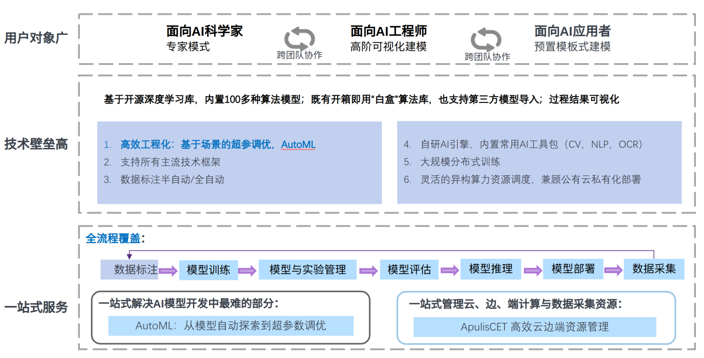

分布式训练任务；AutoML & AutoDL本地化实践能够是科研或工程可以在本地应用到最新的技术框架，自动化的或半自动化的标注数据，优化训练模型。

开源开放的技术体系可以使得科研机构，工程工业厂家机构放心的，自由的适配兼容已有的工具和业务平台，快速实现一体化的AI应用落地。

## 技术创新

依瞳人工智能平台最先实现模型训练到部署的全流程管理，实践AutoML+ AutoDL，采用数据驱动策略，开发了In Memory Data Gir技术，独有的高性能分布式计算引擎，虚拟化异构资源池设计，帮助各个领域的开发者、企业提供零门槛AI开发平台，内置丰富的预训练模型，支持公有云/本地服务器/设备端等灵活的自动化服务部署服务，已在工业、零售、制造、医疗等领域落地。

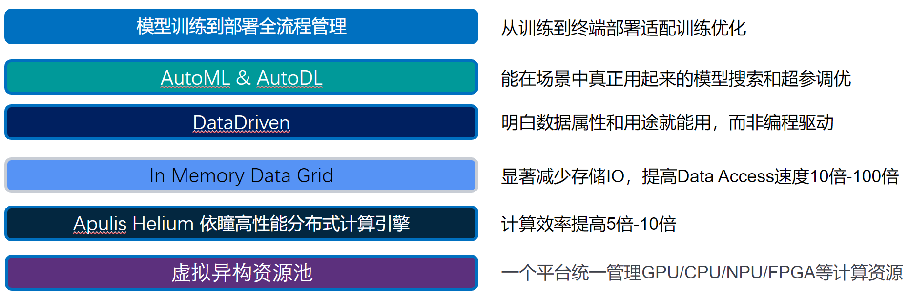

### 模型训练到部署全流程管理

依瞳人工智能开放平台从AI开发应用角度出发，基于国内外主流深度学习框架，提供从数据处理-\>模型开发-\>模型调优-\>模型部署-\>模型发布的一站式开发流程，方便企事业AI开发人员/科院机构快速开展人工智能应用开发。

### 虚拟化异构资源池

基于虚拟化技术可以同一调度X86-GPU服务器，华为基于ARM架构搭载昇腾910训练芯片的鲲鹏服务器以及基于FPGA技术的AI芯片，支持智能化的全面的集群，任务，用户的资源使用监控和实时预警。

### AutoML & AutoDL

传统的机器学习在解决问题时，首先需要对问题进行定义，然后针对特定问题收集数据，由专家对数据特征进行标定、提取特征、选择特征，然后根据所选特征训练模型、对模型进行评估，最后部署到应用上，以解决最初提出的问题。其中数据收集、特征提取、特征选择、模型训练和模型评估的过程，是一个迭代的过程，需要反复进行、不断优化才能得到较优的模型。这个过程非常耗时费力，AutoML
可以将传统机器学习中的迭代过程综合在一起，构建一个自动化的过程，实现自动特征工程、自动管道匹配、自动参数调整、自动模型选择等功能，从而减少时间和人力等资源的浪费。

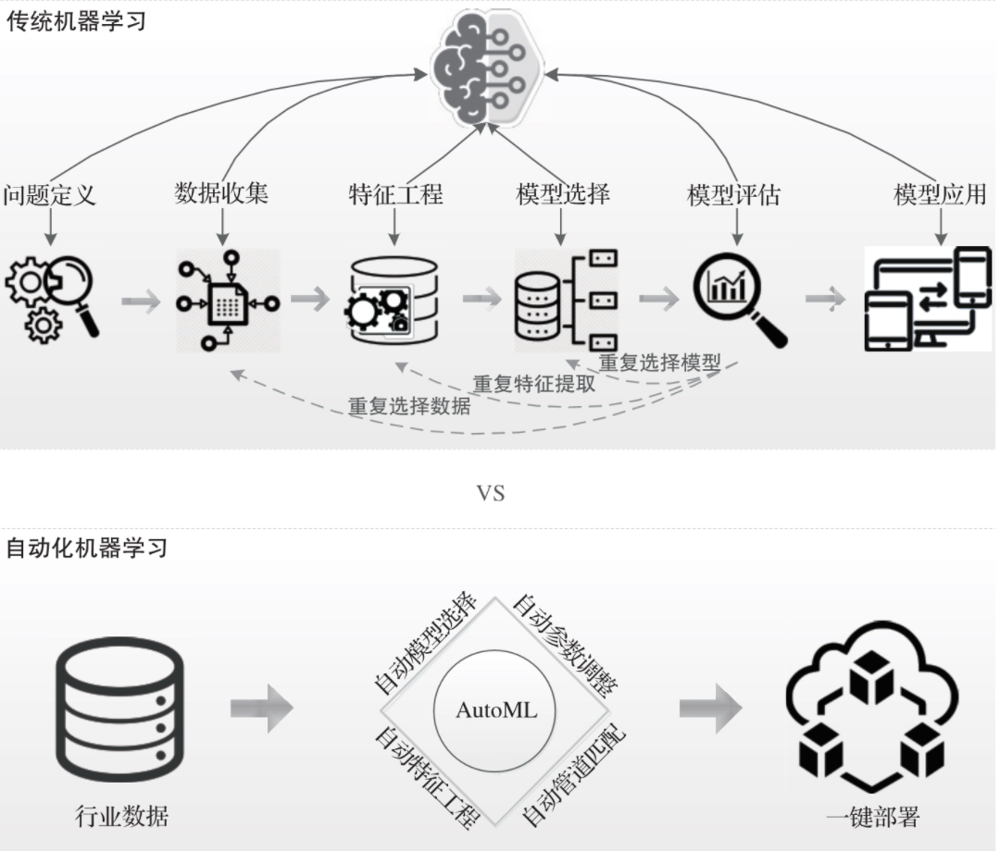

### 数据驱动

针对机器学习中需要对数据进行频繁迭代计算或多次操作特定数据集的场景，平台支持集成Spark计算引擎，方便开发者进行大数据分布式计算。

### In Memery Data Grid

内存数据网格被视为处理迅速、多样和大数据量的大数据的一种方式。将数据存储到内存中，并使其分布到多个服务器上，该方法的目的是更容易获取数据、改进其可扩展性和更好地进行数据分析。该方法早期的使用者仅包括Google、
Facebook 和 Twitter这样的互联网巨头，但是专家称现在该方法逐步成为主流。

### 高性能分布式计算引擎

平台支持主流深度学习框架的集成，如TensorFlow、PyTorch、MindSpore、CNTK、Caffe等，同时以插件化的方式集成多种开发工具，如Jupyter Notebook、VS Code、Anaconda、Colab等，方便AI开发者快速开展人工智能开发应用。

# 平台架构

## 行业应用平台

过去2年，依瞳人工智能平台已经在高校，超算中心，智能工厂，电力企业，生产制造业多个行业，众多企业落地实用。基于自主开源，端到端一站式通用人工智能平台，可以针对各行各业客户具体场景和需求深度定制，完美融合客户已有的业务平台，算法、模型研发工具。

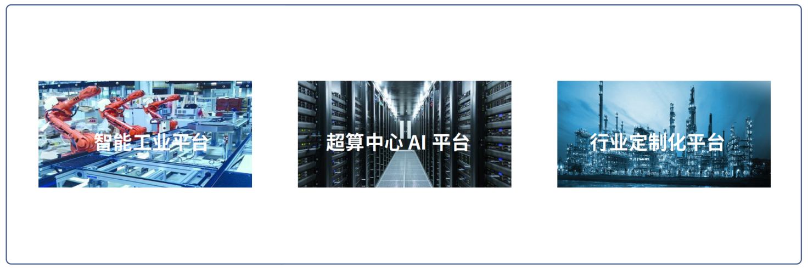

## 技术框架(核心开源）

平台建立了完善的运营体系，支持第三方账户系统接入，计费和工单管理；应用层充分整合数据集管理，标注，模型训练和优化，边端设备管理，镜像管理和自动化运维的需求，面向客户提供开箱即用的模板和配置；抽象了公共业务模块既可以灵活的组建不同的服务中心，也可帮助用户适配已有的业务平台；平台采用业界最成熟、领先的高可用的分布式数据存储方案，支持内存网格管理能够在有限资源下有保障的处理大规模数据；提供私有化镜像服务，模型管理服务极大的方便工程师和研发人员维护和同步数据的工作；完善的网络，数据安全管理策略，配合自动化运维工具技术和完善的日志管理系统，能够充分实现AIOps的价值，将使得科研、模型开发、和一线工程师真正的体验到人工智能平台带来便利和极大的工作效率提升，也使得AI模型落地成为日常业务。

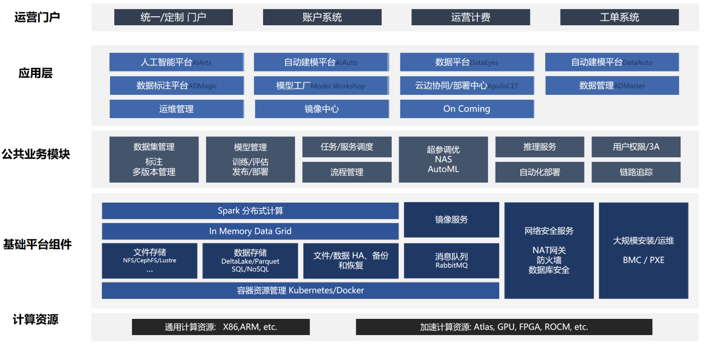

# 安全体系 

继承最前沿的安全经验并结合业界通用标准,制定平台的安全体系。总体上讲,平台的安全体系包括六个方面:

-   物理与环境安全

-   安全流程管理及相关审计

-   灾难恢复和业务连续性

-   云平台安全技术

-   数据安全

## 物理与环境安全

平台所有数据中心的资产包括人员,均采用多种物理安全控制机制。公司有专门的部门负责物理安全,并和运营商以及外包公司签署安全协议,严格控制IDC的物理安全性。

数据中心有严格的安保管理,所有访问都必有相应的授权并有完整的安全记录供安全审计;数据中心每个区域均使用视频监控,且有人员进行巡逻。所有电子记录将进行合理周期的保存。

## 安全流程管理及相关审计

依瞳人工智能云平台安全流程和相关审计严格按照ISO27001国际信息安全管理体系标准构建,确保整个AI平台按照一整套严整的流程和审计标准运作,确保安全相关的信息可追溯。整个流程围绕三个核心:认证机制、授权机制、日志与审计。

## 灾难恢复与业务连续性

为确保运行于AI平台的训练任务和推理业务活动的连续性,保护业务流程不会受信息系统重大失效或自然灾害的影响,并确保他们的及时修复,AI平台严格执行灾难恢复与业务连续性管理要求,主要包括:备份管理与数据恢复、制定和实施业务连续性计划、灾难恢复演练。

## 云平台安全技术

AI平台是构建在微软多年积累的安全架构上,其核心是智能网关、入侵检测和防御系统,流量清洗系统和漏洞检测系统等,可有效实现防DDoS、防黑客以及各类网络4、7层攻击。

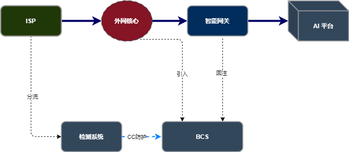

另一方面平台也提供了针对网站的加速、安全防护、搜索引擎优化一体化的安全平台
--
云加速。实现静态资源加速和搜索引擎优化的同时,还有效强化网站的安全和稳定,流量经过网站的云加速节点的同时,恶意的黑客攻击和DDoS/CC攻击也被拦截过滤。恶意网页检测系统采用集群式设计,检测端分析引擎采用IE沙箱动态行为识别技术,监控分析网页加载执行过程中的网页内容和行为,实时判定网页是否存在挂马、钓鱼、欺诈等恶意行为。

## 数据安全

依瞳发布了公司层面的《数据安全策略》,所有数据进行分级保护。所有用户敏感信息,将以最高安全等级"机密"级别进行管理。员工在处理机密数据资产时,必须遵守机密数据管理流程与技术标准要求。主要包括:

-   所有的数据有明确的数据owner和管理者,明确数据访问/使用范围,遵循数据访问权限最小化原则。并通过技术手段和相关流程对数据进行安全管理,推动保护措施的实施。

-   发布明确的制度对机密数据的访问、获取进行管理,包括第三方、政府部门需求的管理。建立明确的访问授权审批要求且所有审批记录线上化。

-   各系统或使用者知道明确的数据销毁处理流程,并采用合理的数据销毁技术。

-   对机密数据管理执行定期审核。

-   所有承载、存储机密数据的系统,必须具备4A基本要求(Account、Authentication、

-   Authorization、Audit)。机密数据的访问必须细化到个人,必须有安全的登录机制,所有人的访问已授权且符合最小化原则,所有行为日志记录齐全且远程备份满足可审计。

-   另外在技术支撑层面,百度智能云数据安全和隔离主要包括三个层面.
    第一层是百度智能云高效的资源池管理技术确保了平台不同用户所属资源间的隔离,主要的技术手段包括:

-   基于虚拟资源池管理技术的CPU、IO、网络以及存储空间的相互隔离,有效防止用户间由于资源侵占而产生的性能干扰,实现故障和安全性的隔离。

-   严格的IAM用户角色管理,不同角色对资源控制权限不同。

-   提供安全的用户认证、授权和传输机制;支持基于签名认证及ACL权限设置的资源访问控制;支持白名单功能防止数据被其他人盗链。

-   VPC网络实现用户自定义网络规划,实现定制化网络隔离。

-   BMR、SCS定制集群,确保相应的集群资源池为用户专有。

第二层是数据加密,平台提供相应的数据加密方案,确保客户敏感数据得到进一步的保护。

第三层是物理隔离和专属安全保障。对于资源使用高敏感用户,也提供专属硬件资源池,计算、存储、网络资源都是客户独享,在物理层面和其他用户都是隔离的,用户所有的服务和应用都会部署在自己专属的硬件资源池中。

# 服务体系

在众多客户AI落地的实践中，发现快速开展人工智能开发任务，打造智能应用业务的急切需求。我们基于丰富的深度学习和机器学习领域知识积累，众多成功AI落地实施经验，合理灵活的组织平台服务组件。有数据标注平台，工业质检平台，自动建模平台，数据集管理平台，云边协同平台，运维中心，模型工厂和镜像中心等。

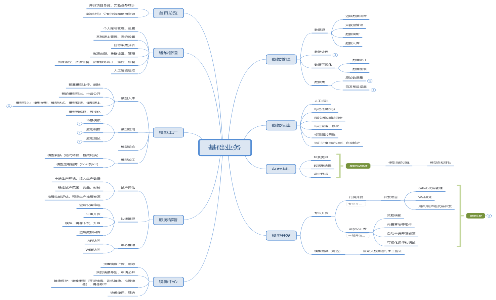

-   数据标注平台

    支持多类型定数据，包括图片、视频、语音、文本等。提供多类型定制化数据标注服务，包括语义分割、图片分类、语言理解、物体拉框、语音转写、人体关键点等。私有化部署平台，传输及处理中全程保护客户数据安全性。基于领先的数据标注平台与成熟的标注、审核、质检机制，为企业AI研发与落地提供高质量测试和标注数据，构建AI数据核心竞争力。

-   工业质检平台

    基于依瞳视觉AI技术提供的新一代集模型训练和预测服务于一体的深度学习平台产品，让用户无需AI基础也能自己训练AI质检模型，实现比传统机器视觉技术更精准的产品外观质量检测。基于AI深度学习技术解决产品外观缺陷检测的端云一体化平台 质量分析预警系统
    基于全量实时质检数据进行的产品缺陷预警和质量趋势统计分析。

-   自动建模平台（AutoML）

AutoML 算法可以帮助研究者自动找出合适的神经网络，无需手动试验。神经架构搜索(NAS)等技术利用强化学习、进化算法和组合搜索等算法，基于给定搜索空间构建神经网络。在恰当的设置下，这些技术找到的神经网络架构优于手动设计的网络架构。

-   数据集管理平台

是数据全生命周期一站式开发运营平台，提供数据集成、数据开发、数据治理、数据服务、数据可视化等功能，支持行业知识库智能化建设，支持大数据存储、大数据计算分析引擎等数据底座，帮助企业客户快速构建数据运营能力。支持管理数据 
创建数据集 导入数据 导出数据 修改数据集 发布数据集 删除数据集
管理数据集版本 难例确认 自动分组 数据特征等。

-   云边协同平台

基于云原生开放框架，提供软硬一体的边云协同解决方案，满足近场、现场全场景边缘业务低时延、数据本地化、边云协同等诉求，赋能行业数字化转型；提供边云一体化的体验与生态，并通过云端管控，使得企业的运维成本可节省80%以上

运维部署中心

面向政府、企业、行业用户的AI运维管理一站式综合监控运维平台。包含配置管理、设备监控、业务监控管理与运维、自动化流程等功能，帮助企业解决IT运维问题，提高运维效率，提升服务质量，降低运维成本。

-   模型工厂

支持预制模型、自定义模型管理，模型上传和下载，模型优化，压缩裁剪，格式转换和应用模板管理等。

-   镜像中心

支持平台私有化部署，本地镜像管理和远程镜像映射同步，镜像版本，tag的常规处理。

# 快速部署支持

随着人工智能在各行业渗透率的不断提高,具备条件的企业都需要尽快制定人工智能部署计划。考虑到人工智能系统的复杂性,企业需要在对该项技术有全面了解的同时,有重点的开始实施,并且建立一定的预期,在一个成功实践之后快速复制到更多领域。依瞳建议可以建立30天AI部署计划,分成6个阶段来实施。

-   第一个阶段(1-5天):制定计划

在采用AI之前有必要先对AI解决方案有清晰的认知,了解当前的应用落地现状以及未来的趋势,并建立企业应用人工智能的目标和愿景。

-   第二个阶段(6-8天):选择场景

AI在企业的各个部门中都有丰富的应用场景,企业可以从需求最为迫切、有一定的数据集、可高度复制的场景优先开始实施。
同时要借鉴市面上的成功实践。

-   第三个阶段(9-10天)成立小组

在制定好AI采用计划之后,要建立专门的项目小组,小组中既包括IT部门人员,也包括相关的业务部门,因为可能还需要业务人员参与数据标注工作。

-   第四个阶段(11-16天)开始测试

从选定的应用场景开始,邀请合适的合作伙伴参与测试。
并评估测试结果是否符合预期,如何在正式上线时获得更好的预测结果。

-   第五个阶段(17-24天)开始实施

根据测试过程、测试效果确定是否需要修订AI实施计划,并正式开始准备上线实施。

-   第六个阶段(25-30天)复制成功

考虑将成功实践复制到更多业务领域,并扩大部署规模。在之后的循环过程中,不断调整工作内容以适应业务需求。

##  30天计划行动指南

+----------------+-------------------------+-------------------------+
| *第1-5天*      | 了解人工智能现状与趋势  | 了                      |
|                |                         | 解当前人工智能落地进展  |
| ***制定计划*** |                         | 、技术路线以及未来趋势  |
+----------------+-------------------------+-------------------------+
|                | 建立人工智能目标与愿景  | 根据企业现状            |
|                |                         | 、挑战以及业务目标建立  |
|                |                         | 企业采用AI的目标与愿景  |
+----------------+-------------------------+-------------------------+
|                | 发布人工智能采用计划    | 建立清晰的目标          |
|                |                         | ,在不同领域采用人工智能 |
|                |                         | 的时间计划以及如何着手  |
+----------------+-------------------------+-------------------------+
| *第6-8天*      | 建立                    | 从需求最为迫切、能够整  |
|                | 应用场景实施路线图,选择 | 合数据资源、决策风险低  |
| ***选择场景*** | 合适的应用场景开始启动  | 、可复制性高的场景着手  |
+----------------+-------------------------+-------------------------+
|                | 借鉴人工智能实践案例    | 借 鉴 A I 部 署 最 佳   |
|                |                         | 实 践,同 时 也 参 考 失 |
|                |                         | 败 案 例                |
+----------------+-------------------------+-------------------------+
|                | 选择合适的合作伙伴      | 选择有                  |
|                |                         | 成熟案例,创新能力强、资 |
|                |                         | 源整合能力强的合作伙伴  |
+----------------+-------------------------+-------------------------+
| *第9-10天*     | 建立项目组              | 可能还需要寻找有        |
|                |                         | 相关数据资源的合作伙伴  |
| ***成立小组*** |                         |                         |
+----------------+-------------------------+-------------------------+
|                | 准备数据                | 数据可能                |
|                |                         | 还来源于业务部门,还需要 |
|                |                         | 业务部门配合数据标注等  |
+----------------+-------------------------+-------------------------+
|                | 落实项目预算            | 为该                    |
|                |                         | 项目落实预算,即使测试环 |
|                |                         | 节可能也存在一定的成本  |
+----------------+-------------------------+-------------------------+
| *第11-16天*    | 开始测试                | 选择合作                |
|                |                         | 伙伴开始测试人工智能系  |
| ***开始测试*** |                         | 统上线应用的效果,确保组 |
|                |                         | 织内部都能够充分理解、  |
|                |                         | 接受并使用人工智能系统  |
+----------------+-------------------------+-------------------------+
|                | 评估是否达到预期效能    | 评估人工智能            |
|                |                         | 系统是否达到了预期效果  |
+----------------+-------------------------+-------------------------+
|                | 修订人工智能行动计划    | 根据测                  |
|                |                         | 试过程修订完善行动计划  |
+----------------+-------------------------+-------------------------+
| *第17-24天*    | 开                      | 正 式 部 署 人 工 智 能 |
|                | 始正式部署人工智能系统  | 系 统,总 结 测 试 阶 段 |
| ***开始实施*** |                         | 的 成 功 实 践 与 潜 在 |
|                |                         | 风                      |
|                |                         | 险,确保正式             |
|                |                         | 上线的系统能够发挥效能  |
+----------------+-------------------------+-------------------------+
|                | 不断优化系统预测准确度  | 与合作伙伴              |
|                |                         | 共同探讨如何优化系统预  |
|                |                         | 测准确度以满足业务需求  |
+----------------+-------------------------+-------------------------+
|                | 确保AI系统持续发挥效能  | 与业务                  |
|                |                         | 部门沟通,确保AI系统满足 |
|                |                         | 真实需求并持续发挥效能  |
+----------------+-------------------------+-------------------------+
| *第25-30天*    | 扩大部署规模            | 扩 大 已 经 上 线 的 人 |
|                |                         | 工 智 能 系 统 的 使 用 |
| ***复制成功*** |                         | 规 模,开 始 孵 化 更 多 |
|                |                         | 的 应 用 场景,并 想 象  |
|                |                         | 更 多 可 能 性          |
+----------------+-------------------------+-------------------------+
|                | 将成功                  | 将成功案                |
|                | 实践复制到更多业务领域  | 例复制到更多的应用场景  |
+----------------+-------------------------+-------------------------+
|                | 持续建设数据平台        | 人工智能系统将无        |
|                |                         | 处不在,企业需要持续建设 |
|                |                         | 以决策为中心的数据平台  |
+----------------+-------------------------+-------------------------+

# AI落地解决方案

## 智慧工业平台赋能工业企业智能化升级

智能质检是实现在工业制造中对产品缺陷的识别及分类，主要应用于电子产品制造、机械装备制造等领域，赋能工业质检和巡检场景，内置器件错漏反、OCR识别、异物检测 胶体检测等场景，提供从数据采集、数据标注、模型开发、模型发布、模型部署、质检应用的一体化解决方案，帮助客户实现智能制造及工业4.0时代的产业升级，提升效率。

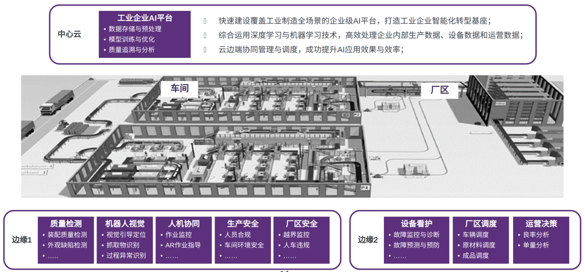

### 助力华为南方工厂智能计算产品智能质检

智能制造解决方案已经在华为东莞松山湖生产基地应用，覆盖计算、5G、终端等产品的80+条产线，主要的应用场景是质检。在依瞳工业质检平台与Atlas硬件设备的支持下，华为制造行业的解决方案做到了"一颗螺丝钉都不放过"：

不仅能够在1000毫米视野下，以99.9%的准确率检出5mm螺丝钉，还能够实现反向检测，确定是否有螺钉等异物散落，并自动校验看物体位置是否准确、偏位。

而且在这样的过程中，华为将质检人员效率提升了3倍。

能够实现如此效果，在于华为解决了AI在工业边缘计算场景的两个挑战：

一方面，做到了算法与工业知识结合，使其有了工业属性，比如采用自学习从良品中学习特征形成缺陷拦截标准等等，来解决工业制造流程中的适应性问题。

另一方面，基于边云协同，将AI应用的开发和部署匹配业务全流程，不仅能够自动校验结果，能够升级工艺定制，还能够细化缺陷类型，实现精细化的检测等任务。

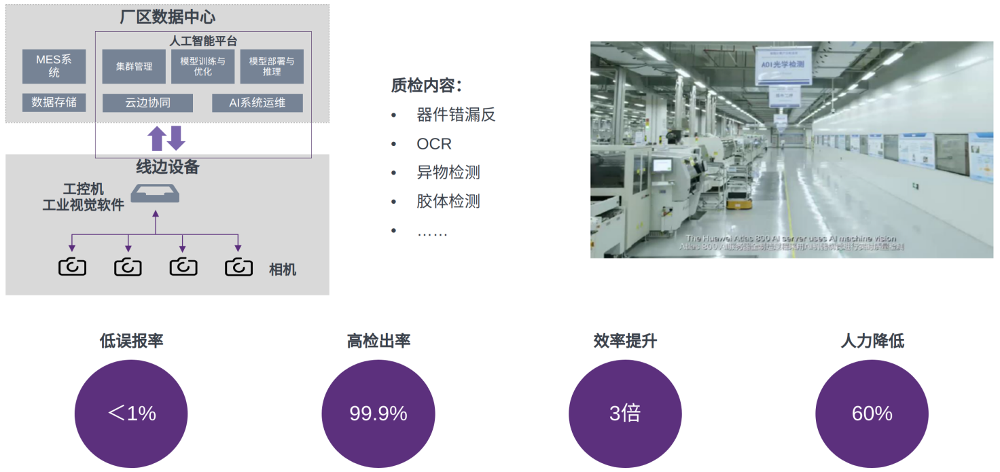

## 作业安全管理及监督可视化平台

电力虽已成为当今世界最不可或缺的超级基础设施，支撑着互联网、移动互联网、AIoT等一个个新时代的发展壮大，但其自身还处于一个人力密集型的状态，数字化和自动化水平非常低下，大量维护运营的工作还要靠电力人翻山越岭、匍匐攀爬，劳苦且低效，危险系数还高。

依瞳面向电力系统生产、检修、施工、抢修等场所的"可视化监控中心"平台，基于AI视觉和分布式边缘推理服务实时监控一线站点、图像、地理位置等信息，及时了解作业现场情况，实现管理人员远程监督作业现场的人员作业行为、例行工作、安全措施设置、设备状态、隐患状况等，既能提高管理人员的管理能力和效力，又能提高对现场作业人员的约束力，同时能实现对历史数据的调阅和浏览，针对后续发现的问题及时进行总结和分析，有效提高作业现场安全管理水平。

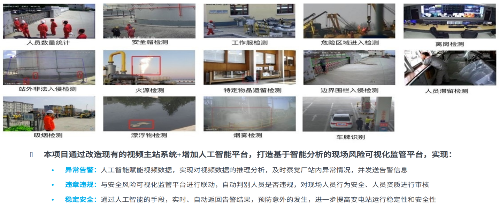

### 输电线路智能巡检训练&推理高效智能

全新升级的依瞳全息可视化智慧巡检方案，可以为能源行业输电线路、智慧变电站、智慧加油站、现场作业安全管控提供一体化、可视化、智能化的解决方案。目前，百度能源行业可视化智能巡检方案已在超过150个智慧变电站、加油站试点应用，累计发现隐患2000多处，每天代替人工巡视的外场作业线路超7万公里。

针对不同的算力需求，云、边、端灵活搭配，基于电力客户的实际需求，联合解决方案集成商、行业硬件厂商等第三方伙伴，通过统一接口标准，服务容器化部署，联合开发应用软件、算法移植，提供端到端行业解决方案，共同构建行业共赢的合作生态。

作为华为全栈全场景AI解决方案的重要组成部分，搭载Atlas200/300AI加速模块，Atlas800-910训练服务器的依瞳人工智能计算平台以超强算力著称，可赋能客户适应边缘智能的兴起，赢得AI未来。

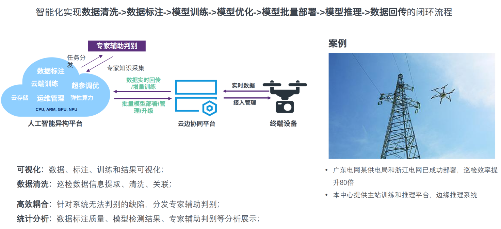

## 新一代人工智能开放科研教育平台

服务中国人工智能领域科研与教育事业的合作平台体系。秉承着开放互通是基础、服务科研和教育是核心、共享共赢是未来的理念，智新平台面向中国高校提供计算平台、算法与工具、数据和课程这四大核心资源和服务，开展联合科研、课程共建、师资培训、实习实训和国际交流等各项合作，旨在构建开放、开源的中国人工智能科技创新与教育合作体系，助力中国新一代人工智能领域科研成果的迸发，促进高端科技人才的培养与共享科教生态的建立。

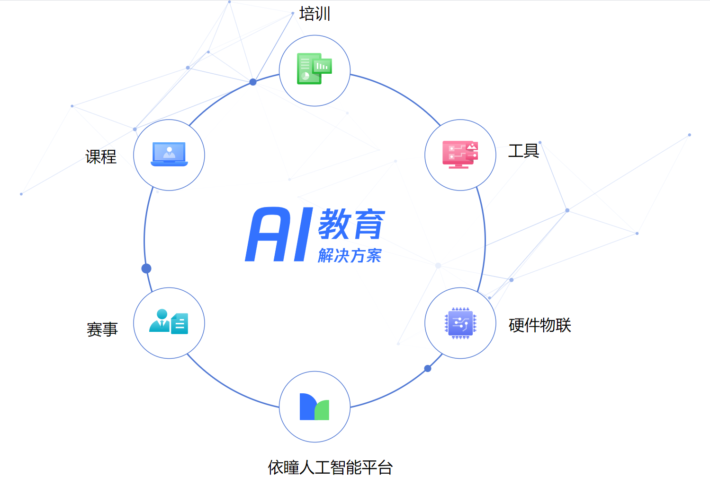

### 支持昇腾社区开展高校拓展活动

去年9月依瞳曾支持Mindspore社区开展模型众筹活动，平台的灵活性，易用性，兼容性，稳定性获得CANN技术专家，华为相关领导一致好评。今年我们将继续助力昇腾高校行活动，帮助广大学生了解人工智能开发和训练，帮助他们快速便捷实现AI科研，AI应用开发和学习。

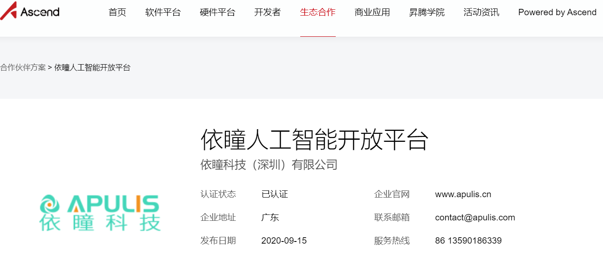

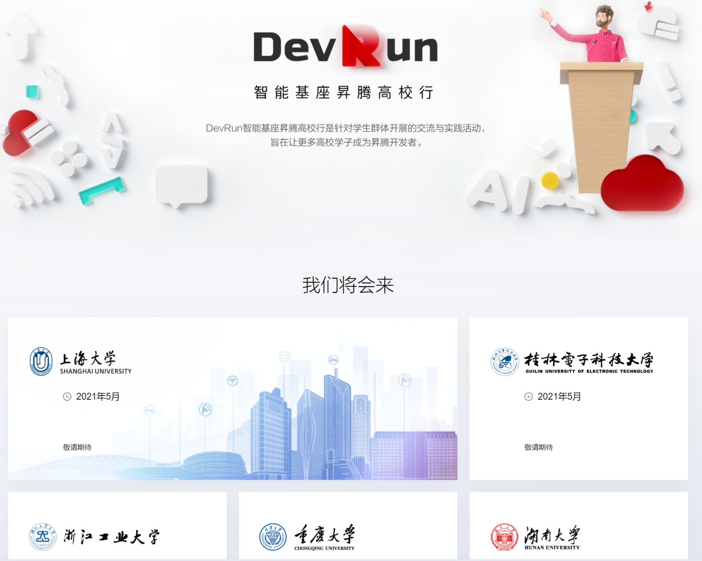

# 生态建设

行业智能化升级已是大势所趋,而人工智能技术应用的复杂性决定了大部分企业很难在短时间内从零开始实现智能化升级。要使AI在各行各业产生效能,离不开产业链上的紧密合作。从技术到应用,需要从硬件到软件到应用服务厂商再到终端用户的无缝衔接。

## 人工智能生态的演进: 高度集中-各自为政-各司其职

几乎所有的新兴技术市场都遵循同样的生态演化路线:从由创新型企业主导,市场高度集中;到新玩家不断加入,产业链高度细分,用户独立创新;再到细分产业逐渐整合,参与者各司其职。人工智能市场也不例外。在本次人工智能浪潮兴起的前2年,几乎在每个子市场,Top5的技术供应商能占据超80%的市场份额;作为技术使用方,一些大型企业用户也积极开放地与AI创新型企业合作。而在最近1年内,随着技术供应商的不断涌入,以及企业开发能力的不断提升,市场开始出现软件供应商、硬件供应商、终端用户各自为政的局面,市场也越来越分化。借助开源技术的支持,终端用户也开始坚持自主研发、联合创新以及外部采购结合的策略。
可以说,当前的市场格局正处于产业生态的2.0阶段。

> 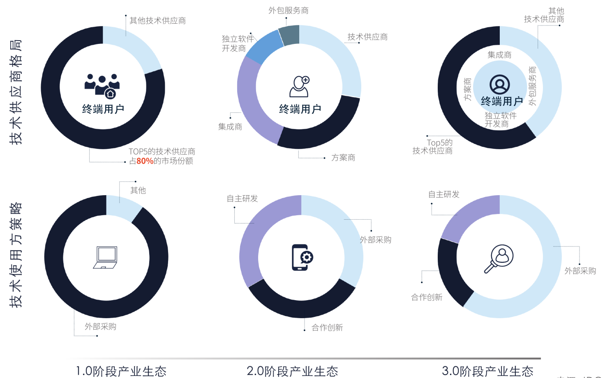

## 下一个阶段: 高度整合,各司其职

在繁杂无序的人工智能产业生态中,IDC看到只有部分平台型厂商在现阶段开始整合市场资源,构建可以最大限度发挥价值的生态圈。
这也意味着更高一级、更有利于提高产业效率的人工智能市场生态即将到来。

未来的人工智能产业链可以简单分为5层,包括底层硬件、开源框架和库、平台型技术供应商、基于平台开发应用的解决方案商和独立软件供应商以及终端用户。另外,衔接底层硬件到终端用户的重要角色还有开发者和系统集成商。

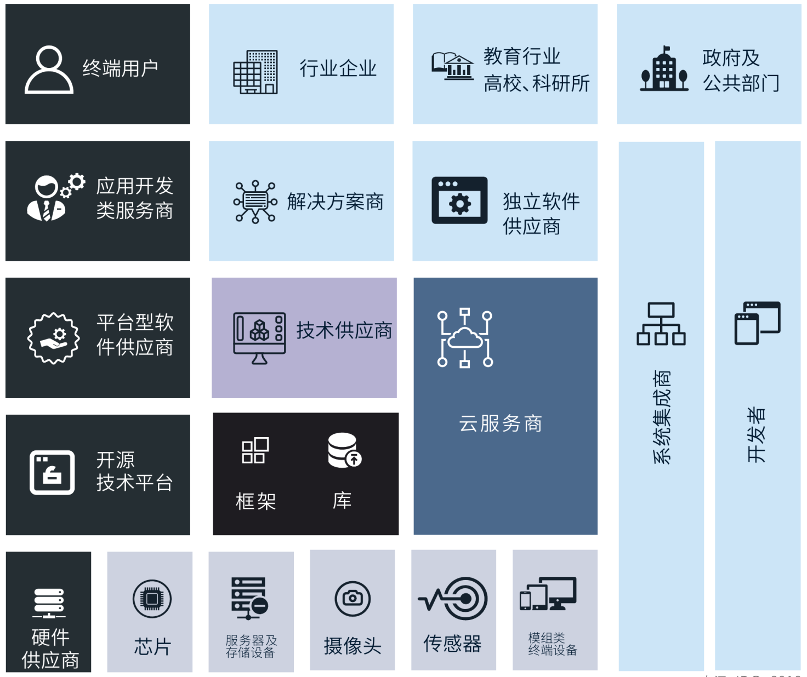

硬件供应商:
硬件层重点包括AI加速芯片以及提供人工智能专用服务器的厂商。

-   芯片:
    典型的人工智能加速芯片厂商如NVIDIA以及Intel都推出了芯片编译平台,并在其中支撑开源框架以及主流算法,为异构计算平台提供底层加速技术支撑。

-   AI加速服务器:
    即在CPU之外还采用GPU或者FPGA或者ASIC等进行计算加速的服务器。

-   传感器模组:
    包括摄像头、麦克风阵列等。AI时代与其他信息技术的重要差异之一即在于传感器模组的重要性。
    麦克风阵列需要能"听见"语音,摄像头要能"看清"图像,这些硬件智能化升级离不开软件技术的创新。

2)开源技术平台:
开源社区已经成为技术创新的重要源泉,人工智能领域尤其如此。驱动人工智能创新的典型的开源框架既有国外谷歌发布的TensorFlow,Facebook发布的Caffe/PyTorch,Amazon发布的MXNet,也有来自于国内的Miindspore产品。
粗略估计,目前市面上90%以上的人工智能产品、应用都是基于开源技术。

3)软件平台型厂商:
该类型厂商按照技术分类可分为通用机器学习平台、自然语言处理类、计算机视觉类、知识图谱类厂商。
平台型厂商提供包含了训练好的模型的通用技术平台,可以面向应用场景提供推理服务。

4)应用开发类服务商:
应用型厂商通常是技术走向用户不可或缺的一环,该类厂商通常能够深入理解用户业务流程以及需求,能够推动技术落地为应用。但由于当前人工智能市场正处于初期发展阶段,该类厂商中具备AI开发能力的人才较少,因此应用型厂商也是人工智能产业生态的薄弱环节之一。

5)终端用户:
包括行业企业如金融、制造、零售等,也包括政府以及公共部门,高校等研究机构。

另外还有两类不可忽视的角色:一是开发者:人工智能开发者的重要性越来越被广泛认可,原因一方面在于人才缺乏已成为限制技术推广的因素,另一方面应用的创新也来自于开发者的技术创新。不仅是技术供应商需要具备AI开发人才,应用开发类服务商也需要储备模型开发人才。二是集成商在AI时代同样重要:集成商的工程化能力将加速AI落地进展。

## 寻找伙伴共同激活AI能力

与以往的信息技术产业不同,人工智能产业生态更加融合更加复杂,对数据化程度和技术水平要求更高。
产业参与者不应仅满足于单纯的技术采用,而应构建更广泛的合作伙伴网络,并打造合作创新的平台,以充分利用人工智能带来的机会获得更高效能更高价值。

> 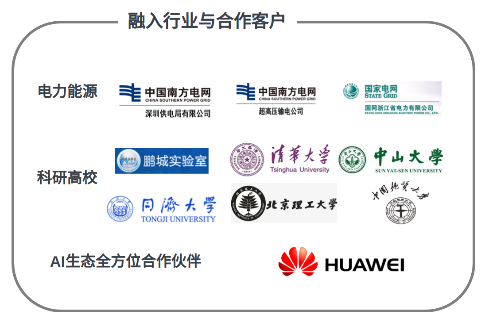

# 资质认证 

依瞳人工智能平台致力于为客户提供安全可靠、高效智能的私有AI云服务,持续接轨全球法规政策、行业标准要求。请您参考相关安全合规。

目前，我们已取得的权威资质。

> 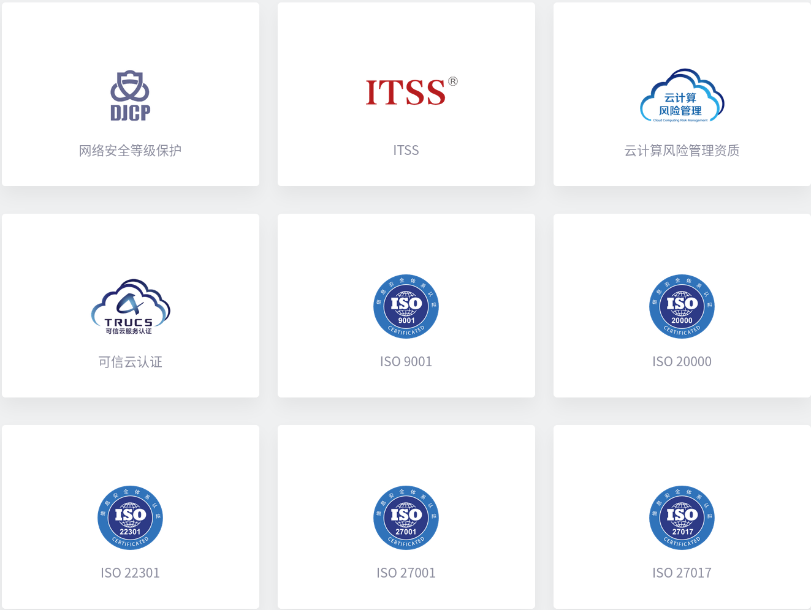

# 结语

从产品服务侧到生产模式、运营模式再到决策端,人工智能正在从时间、效率、人力等各个方面为企业带来经济效能。已经从人工智能系统获利的早期采用者正在考虑进一步扩大投资,在企业中全面广泛应用AI,以期获得更大价值。处于反复测试、验证阶段的企业也在加速正式上线计划,确保AI系统在生产环境中快速迭代并趋向成熟稳定。不能抓住智能化升级机遇的企业将面临失去竞争力的风险。预计未来人工智能技术的全面应用将为各行各业带来上万亿美金的新机会,而能否抓住人工智能带来的机遇为企业建立核心竞争优势取决于企业如何行动。

展望未来,结合云计算、大数据、物联网等创新技术,人工智能将为企业为社会带来更加深远的影响。在未来的商业范式下,企业与企业之间,企业与人之间,人的工作场景与生活场景之间,都将是智能互联的系统。在新的趋势下,企业尤其需要有一个智能核心平台赋能内外部系统的连接和智能化应用。
如果您还没有将IT环境改造成智能化驱动的高能组织,从现在开始,评估人工智能和机器学习如何影响您的业务。
