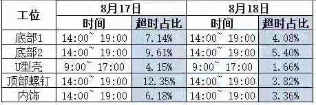
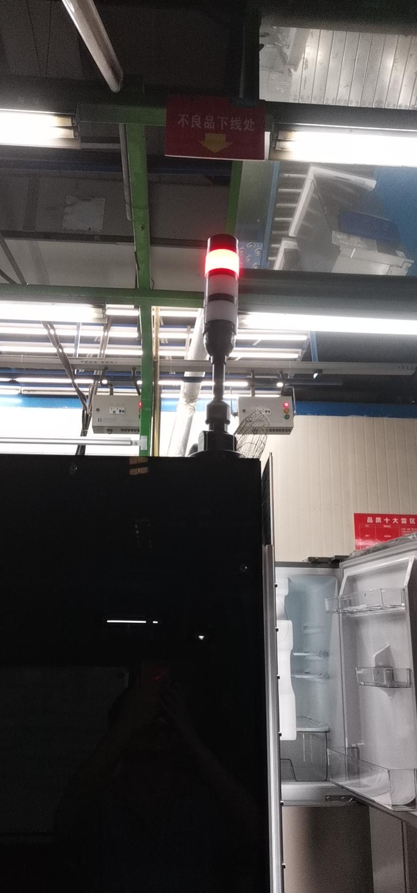
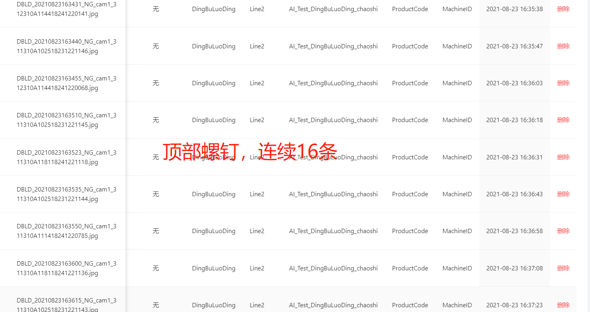
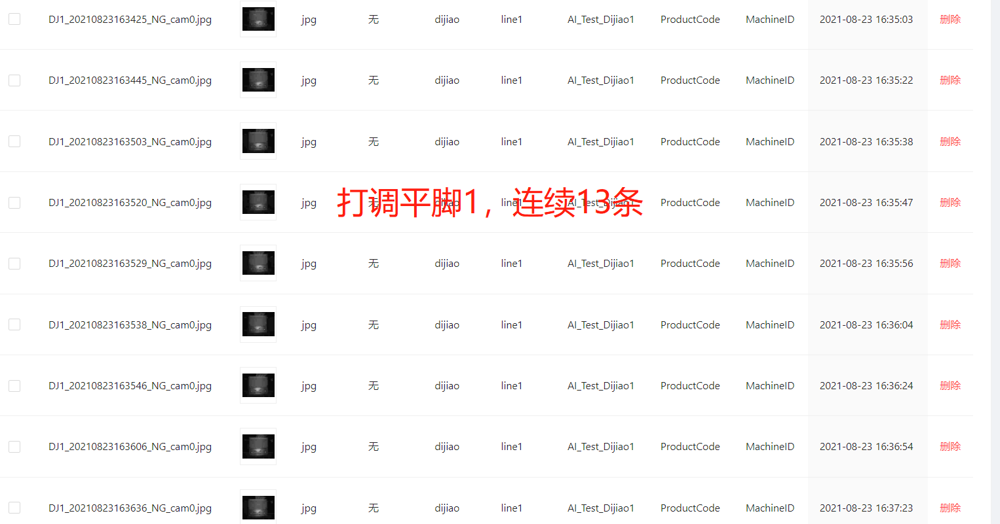
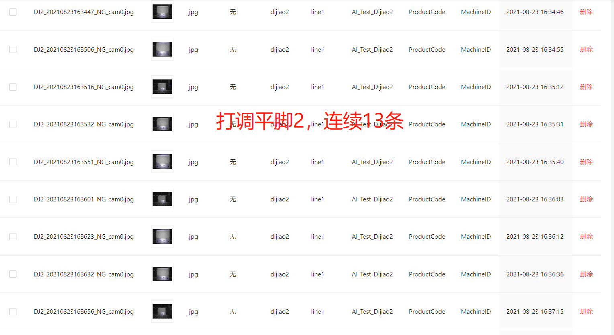
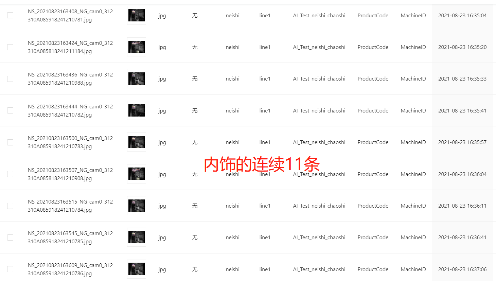
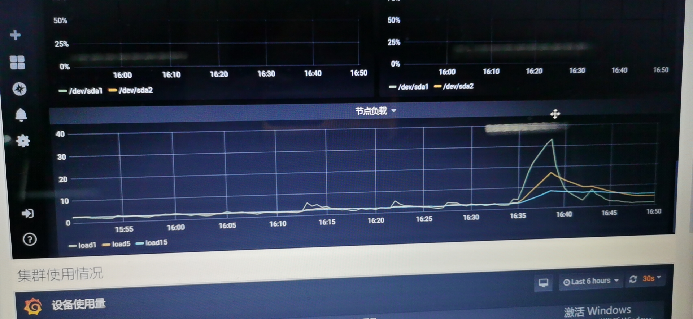
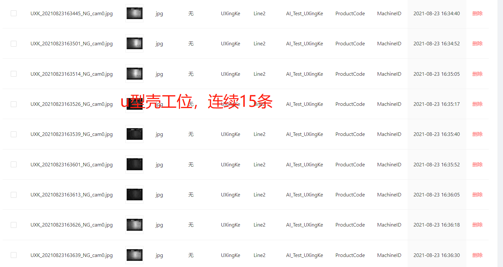

# 平台使用沟通

## 平台环境

1 训练服务器 + 1 推理服务器

**推理服务器 2 * 24核**

+ 5个工位6个推理，每秒6个请求是可能的，工控机的超时间隔为5s，超时请求的响应时间一般在11s 以上。
一个工位可能有2个摄像头，每次请求发一张图片；实际统计1小时发送了361个请求
每台摄像机大概是2K的像素，实际照片可能在3M~10M。

每小时的极限请求数 60*60*6 = 21600; 一般没有这么高。不考虑图像大小。

## 遗留待解决问题问题

1. 推理服务响应400 或概率性出现超时

**其中工控台的超时时限为5s！**

* 集中度高超时的有2到3次/天！

2021-08-23日
11:03:
13:29:54只有1个内饰推理服务,
14:35:04有2个推理服务 全部6个推理服务超时,
15:54:43有1个底脚服务超时,
16:03:46有2个顶部螺丝，底脚服务超时；  
共计出现5次;

总体上所有工位，所有推理服务可能同时受到波及！
* 推理应用（SDK）正常处理时间0.2 ~ 0.6s, 超时求的推理处理时间超过5s， 
* 每次超时响应时间最少 11s ， 最长有33s; 超时请求最少 5个，常见12左右，最多20个以内；
* 每次超时会触发工控台告警，最短告警时间1min，一般5min。

* 故障分析

虽然23日上午定位查看推理节点网络，资源负载处于稳定较低的25%~50%的情况；出现超时时只有节点的负载有10~20的波动；推理处理超时5.014s; 表面看可能是推理应用可能出现僵死；但是每次多个甚至6个推理全部超时情况无法解释，
后端，运维分析为推理SDK没有响应请求，这个定位结果不被认可！

+ 主要情况：
华为推理SDK已经修改了log, 图片jpg读写删除问题。
- 从8.2日开始跟踪定位到23日，我询问才发现超时的具体数据，如工控机时延，超时频率，工位推理服务分布情况
- 依瞳平台IO,负载，消息处理相关方面没有数据，部署的平台NFS, IO， 耗时统计是空白！没有有效日志！
- 做为（部署编排）推理（网络应用）服务，基本没有考虑请求风暴，服务弹性扩容，流量分发，且先不考虑更大规模的产线；这种认为请求直接到应用，应用不响应就超时的定位，极其愚昧，不负责任，毫无专业性！
- 另外就目前基座，k8s etcd， 数据库，存储都没有优化配置

* Error photo logs

---

**推理服务端出现双重响应**

起初一直以为是coredns的问题，于是找运维升级了下coredns版本再进行压测，发现问题还是存在，说明不是版本的问题，难道是coredns本身的性能就差导致的？想想也不太可能啊，才 200 的并发就顶不住了那性能也未免太弱了吧，结合之前的压测数据，平均响应都挺正常的(82ms)，但是就有个别请求会延迟，而且都是 5 秒左右，所以就又带着k8s dns 5s的关键字去 google 搜了一下，这不搜不知道一搜吓一跳啊，原来是 k8s 里的一个大坑啊(其实和 k8s 没有太大的关系，只是 k8s 层面没有提供解决方案)。

*5s 超时原因*

linux 中glibc的 resolver 的缺省超时时间是 5s，而导致超时的原因是内核conntrack模块的 bug。

Weave works 的工程师 Martynas Pumputis 对这个问题做了很详细的分析：https://www.weave.works/blog/...
这里再引用下https://imroc.io/posts/kubernetes/troubleshooting-with-kubernetes-network/文章中的解释：

DNS client (glibc 或 musl libc) 会并发请求 A 和 AAAA 记录，跟 DNS Server 通信自然会先 connect (建立 fd)，后面请求报文使用这个 fd 来发送，由于 UDP 是无状态协议， connect 时并不会发包，也就不会创建 conntrack 表项, 而并发请求的 A 和 AAAA 记录默认使用同一个 fd 发包，send 时各自发的包它们源 Port 相同(因为用的同一个 socket 发送)，当并发发包时，两个包都还没有被插入 conntrack 表项，所以 netfilter 会为它们分别创建 conntrack 表项，而集群内请求 kube-dns 或 coredns 都是访问的 CLUSTER-IP，报文最终会被 DNAT 成一个 endpoint 的 POD IP，当两个包恰好又被 DNAT 成同一个 POD IP 时，它们的五元组就相同了，在最终插入的时候后面那个包就会被丢掉，如果 dns 的 pod 副本只有一个实例的情况就很容易发生(始终被 DNAT 成同一个 POD IP)，现象就是 dns 请求超时，client 默认策略是等待 5s 自动重试，如果重试成功，我们看到的现象就是 dns 请求有 5s 的延时。

**参考：**
https://segmentfault.com/a/1190000021260977
https://zhuanlan.zhihu.com/p/77808615
https://cloud.tencent.com/developer/article/1449227
https://cloud.google.com/kubernetes-engine/docs/how-to/ingress-features?hl=zh-cn

