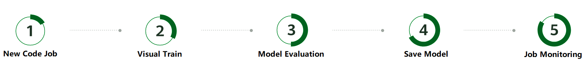

# Quickly Startup

XXXXXX AI Platform is a one-stop AI development platform that enables developers and data scientists of any skill level to rapidly build, train, and deploy models anywhere, from the cloud to the edge.
Accelerate end-to-end AI development and foster AI innovation with key capabilities, including data preprocessing, semi-automated data labeling, distributed training, and automated model building. 

## Overview

**AI Development Lifecycle**

Simple, powerful, and accurate AI development

*Create Environment | Visual Train | Model Evaluation | Save Model | Job Monitoring*

Before you start, carefully complete the preparations described in Preparations. To use a built-in algorithm to build a model, perform the following steps:

* Step 0: Prepare Data
* Step 1: Create a Code Development to Train a Model and Perform Prediction
* Step 2: (Optional) Create a Visualization Job to View the Model Training Process
* Step 3  Evaluate the model and analyze the performance indicators
* Step 4: Save the Model
* Step 5: Monitor the resource utilization
* Clean Env: Delete Related Resources to Avoid Device occupied

## Preparations

You have registered with XXXXXX AI Platform and checked the account status before using platform. The account cannot be in arrears or frozen.
Your account must be assigned to a resource group (Virtual Cluster), that has 1 card (NPU/GPU) for training at least.

## Step 0: Prepare Data

We provides a sample dataset hardhat named hardhat_uniform. This example uses this dataset to build a model. Perform the following operations to upload the dataset to the Shared storage `/data/dataset/storage/hardhat_uniform/` created in preparation.

**NOTE:**

*Data labeling has been completed for the hardhat_uniform dataset. The .json files are the labeling files of the corresponding images. Therefore, the data labeling operation is ignored in this step.*
*If you want to use your own dataset, skip this step, upload the dataset to the share folder, and select this directory in Step 1: Train a Model. If your dataset is not labeled, choose Data Management > Datasets to create a dataset and manually label your dataset in Data Annotations before creating a training job.*

## Create a Model Development Job

After data preparation is completed, use a notebook to setup code for modeling. platform provides a pre-trained modeset named as model-gallery, you can look through the code file at `/data/model-gallery/models/`, divided into different categories by computing type and frameworks like GPU/NPU, tensorflow or mindspore, and many models have pre-setup or pre-trained.

1. On the Platform dashboard, click Code Development in the left navigation pane.
2. 

### Upload Data

### Remote Debug

## Step 2: (Optional) Create a Visualization Job to View the Model Training Process

### Job Monitor

## Step 3  Evaluate the model and analyze the performance indicators

* Step 4: Save the Model
### Backup Environment

* Step 5: Monitor the resource utilization
* Clean Env: Delete Related Resources to Avoid Device occupied

## Pre-setup Supports

## FAQ:

