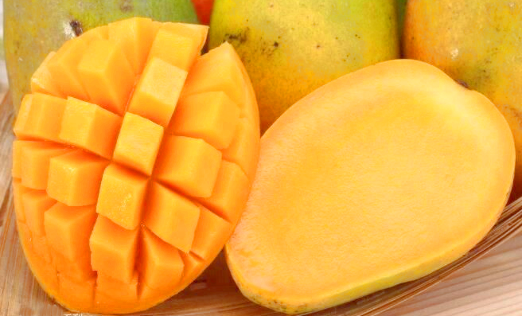
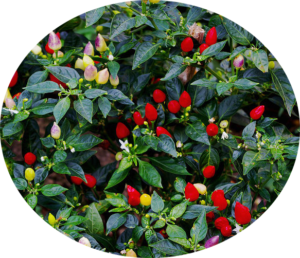
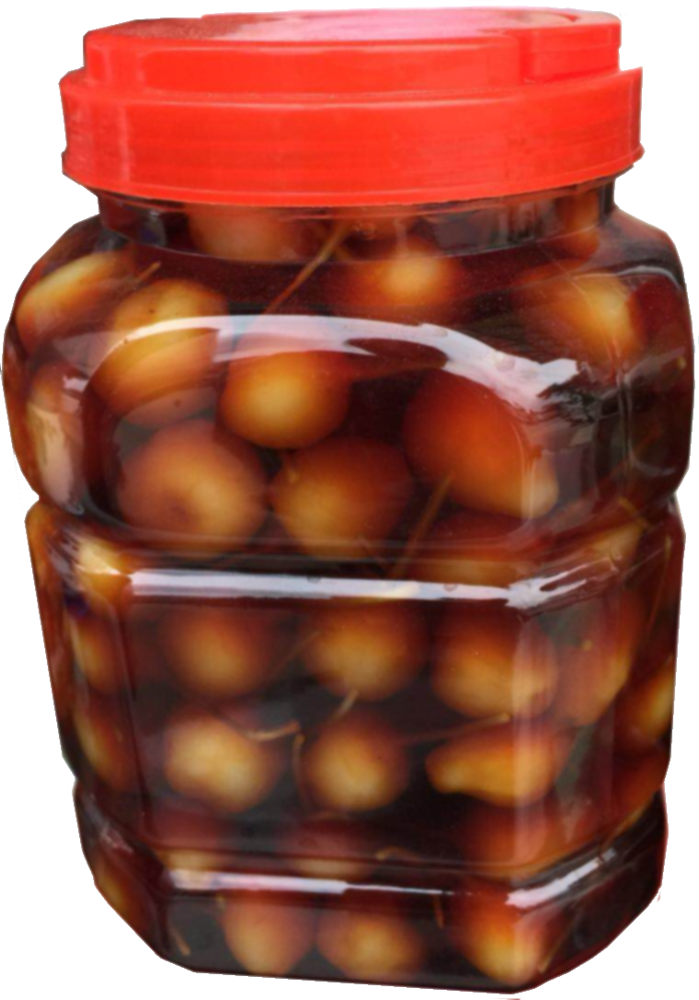

**南宁,古谓邕州，盛产东南亚生鲜水果，今日推荐芒果和五彩椒。**

引古助兴：

### 登邕州春野亭寄桂帅潘伯恭学士

#### 宋·陶弼

#### 二纪看花瘴雾中，野园今日又东风。

#### 人心有感时时别，天地无私处处同。

#### 长笛一声诸曲静，巨觥双饮百愁空。

#### 风清水暖群鱼上，谁向荆溪下钓筒。

* 百色芒果外观靓丽、香气浓郁、味道甘甜、品质优良，果实皮色新鲜，着色良好有光泽，外观亮丽，果粉较厚；果肉呈黄至橙黄色，核小肉厚，肉质嫩滑，纤维少，口感清甜爽口。

芒果在百色种植历史已有三百多年。《广西通志·卷二十》记载“芒果田州土州（今田东、田阳）出树扶疎（shū）直上枝叶秋冬不凋每二月另抽嫩枝细花丛生色淡黄结实五月熟大如桃黄色味甘香。”《横州志》（1899）记载：南宁、镇南、田南（右江区）出产扁桃（柳叶芒）“冬不凋”，最好的食用方法为“熟则自落，藏一、二日，肉成膏液，味甜而甘，如摘食之则酸。”

* 五彩椒系椒中之珍品, 它集食用、药用、观赏于一体, 同株果实有绿、黄、白、紫、红五色, 鲜艳夺目, 具有光泽。株高约50厘米左右, 株产果可达250个, 辣味素含量是普通辣椒的10倍，亦可腌制长期食用。

