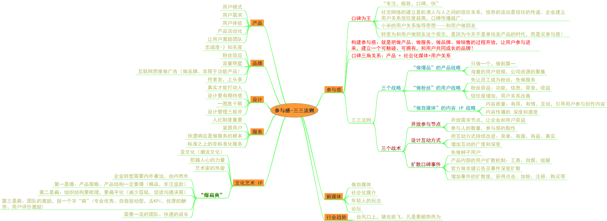

《参与感》读后记
=========================================================================

—— 小米口碑营销内部书册

猪会飞的背后，参与感就是“台风”。

人是幸运的，生活是不幸的！只要生活，我们就参与了诸多事务，要做好一件事需要全身心的投入，大家心里都知道该怎么做好一件事情，但不知道该怎么取舍和投入。《参与感》内容详实，讲了设计营销品牌遇到的问题及其解决之道，与大多数的产品经理，设计书不同，没有搞很多概念范式，而是平实的边尝试边想边做的过程。

品牌及口碑，信息趋向对称，也是我个人的一些想法。设计思路，创作者都是很明白的，不同的是他们做的更鲜活，参与到用户中，社区中富有生活气息，他们将创作者开放了，将高冷放在了饭桌上。有玩着之心的团队，用户投票激励。

我将书中的主旨简单整理，以备参阅。

将产品看成是一个自然物体，既要“生”，也要“活”；作为创作者既要把产品做出来，也更要把它放入社区中，活起来，有自己的格调和口碑，需要努力拼搏。

* 书籍信息：

《参与感》小米口碑营销内部手册 小米联合创始人 黎万强（珍藏版）中信出版社  2018年6月第2版

